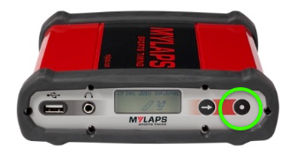

## Sqorz is not picking up the decoder on the network

There are occasions where Sqorz is not able to pick up the decoder on the network. 
While there could be many reasons for this the most common is IP Address mismatch. 

In simple terms the IP address of the computer and the IP address of the 
decoder must line up, if they do not communication between the two devices is not possible.

The solution is to check the IP addresses of the computer and the decoder 
and if they do not line up to change one of them so they do.

Understanding a few IP address fundamentals can help troubleshoot when an issue like this arises.

## What is an IP address?
- An IP address, or Internet Protocol address, is a series of numbers that identifies any device or computer on a network
- IP addresses are used by devices to communicate with each other over the Internet and on local networks
- Every device must have an IP address to communicate
- Devices can only communicate with each other on a network if they have similar IP addresses
- IP addresses must be unique, no 2 devices can have the same IP address
- Computers can have 2 IP addresses
    * One for the Ethernet connection
    * One for the wifi connection

## How does a device obtain an IP address

### Automatically (Setting = Auto)

- The IP address is automatically obtained from a router when the device is connected to the network
- The IP address can change every time the device is connected to the network (often it does not)
- Usually automatically obtained IP addresses are in the format 192.168.xxx.xxx

### Self-Assigned (Setting = Auto)

- If the setting is Auto and there is no router on the network the device will ‘self-assign’ an IP address
- This IP address will change every time
- Self-assigned IP addresses always begin 169.254.xxx.xxx 

### Manually Assigned (Setting = Manual or Static or Not Auto)

- IP address has been manually assigned to the computer by a person
- A static IP address will never change
- Most static IP addresses have the format 192.168.xxx.xxx  

## How to find the IP address on your Windows computer

- Go to the Search bar at the bottom of the computer screen
- Type “CMD”
- A black box will open
- Type “ipconfig” in the black box
- The computer IP address can be seen under
   # Ethernet adapter; OR,
   # Wireless LAN Adapter

## How to find the IP address on a MYLAPS decoder

- Press the right hand button on the front of the decoder
- Read the IP address from the screen

## Troubleshooting

- Check the IP address of the decoder and the computer are similar
- For self-assigned IP addresses the first 2 segments must be the same i.e 169.254.xxx.xxx
- For Automatically or manually assigned IP addresses the first 3 segments must be the same i.e. 192.168.1.xxx
- If the IP addresses are not similar then this is likely to be the problem