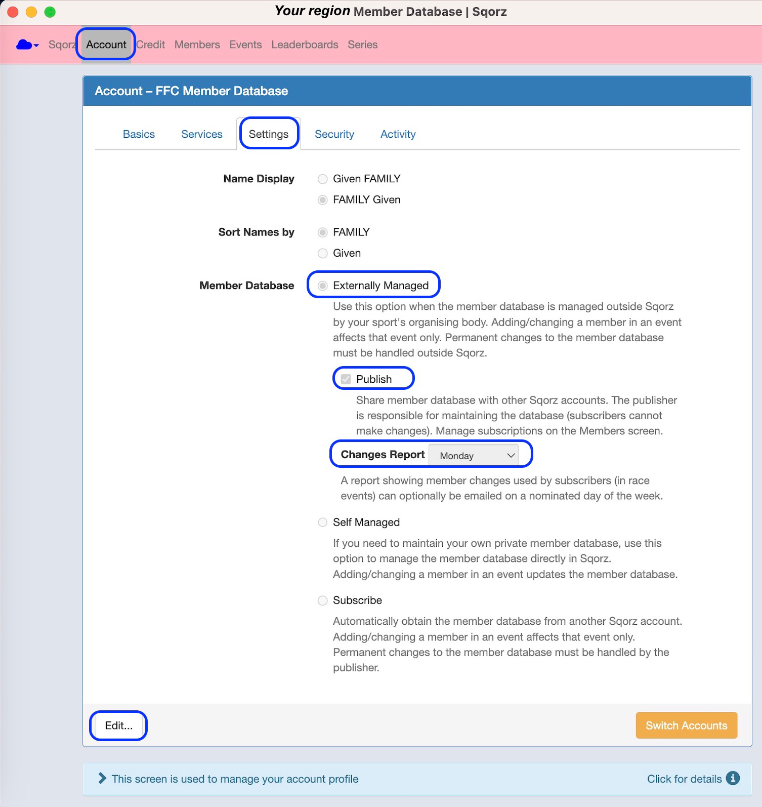
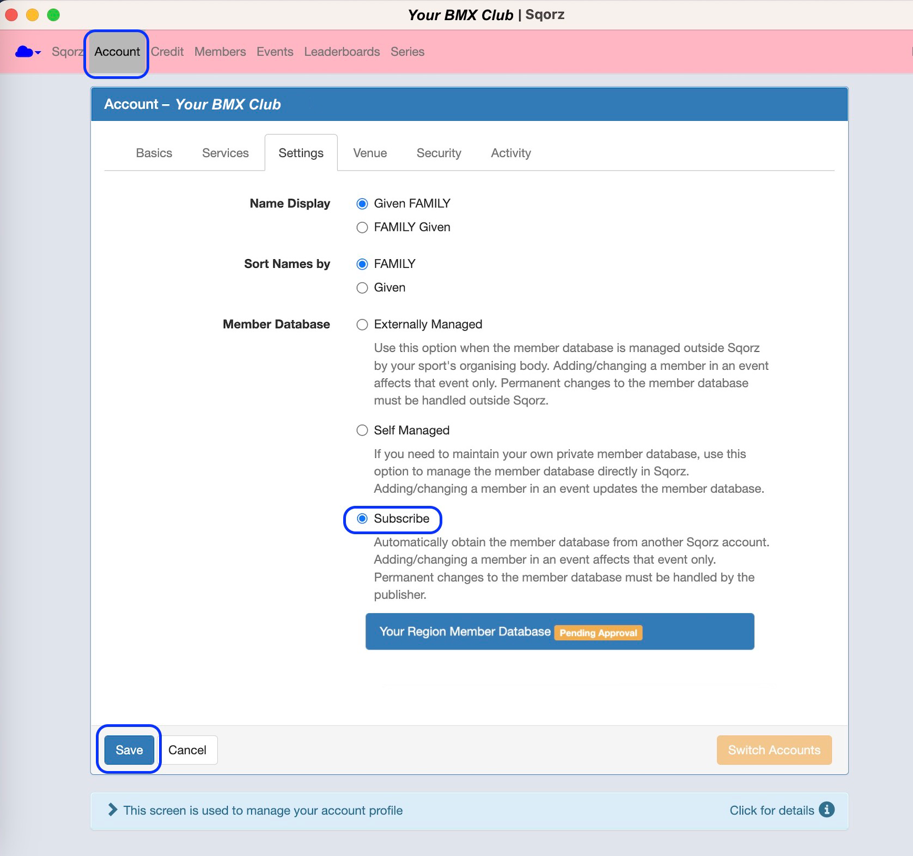
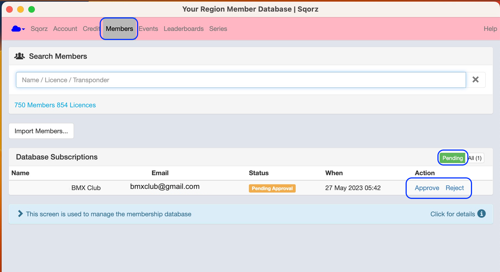

##Preamble

There is an excellent option in Sqorz for sharing the National Member Database with 
clubs/organisations within a single jurisdiction/region.

The member database is maintained by the national organisation and imported 
to a special Sqorz member database account created specifically for this purpose. 
The import can be manual using a spreadsheet for example, or automated using an API.

Other Sqorz accounts in the same region (e.g. clubs) have the option to request a 
subscription to the national member database account. The administrator of the 
database account can approve or reject the request. If the request is approved 
the clubs will receive a copy of the member database in real time ensuring they 
always have the most up to date information.

Data is encrypted and can only be read by Sqorz.

The advantages are:

- Standardise information across all Sqorz accounts in the region
- Real time updates
- Safe data distribution (no need to send member information in spreadsheets by email)
- Reduced manual process
- Consistent with Cybersecurity best practices

## Setup Member Database Subscription Feature

Create a new Sqorz account and give it an easily recognisable name e.g. ***Your Region*** **Member Database**

1. Import the member database into Sqorz via spreadsheet or API
2. Go to Account > Settings
3. Click **Edit** on the bottom left of the screen
4. Under Member Database select ‘Externally Managed’ and click the ‘Publish’ check box
5. Select a day when the Changes report will be generated and sent
6. Click **Save** on the bottom left of the screen
7. Create a process for regular updates to the member database

!!!NOTE 
    **Member database subscription feature can only be setup in Regional or National accounts**

{: style="width:700px"}

## Club Request For Subscription to the Member Database

1. In the club account go to Account > Settings
2. Click Edit on the bottom left of the screen
3. Under Member Database select ‘Subscribe'
4. Click on the member database name
5. Click Save on the bottom left of the screen
6. This will send a subscription request to the member database administrator

{: style="width:700px"}

## Approve / Reject a Member Database Subscription Request

1. In the Member Database account
2. Go to Members > Database Subscriptions
3. Either **Approve** or **Reject** the request

{: style="width:700px"}
