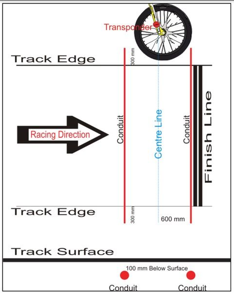

## Preamble

BMX timing system installations differ from track to track depending on a number of factors:

- Requirements 
- Budget 
- Physical layout of the track
- Location of the registration / administration office

There are a number of Best Practices that have been established based on considerable
experience in timing system installations globally. Be prepared to have an open mind,
the installation is an investment in time and money and will be around for a long time.
Getting it right now will pay dividends in the future.

Take the time to investigate timing system installations in other tracks, look at
what they did and why. Don’t just follow USABMX, their installations are for racing
on the national circuit and do not take into account gate practice, training etc.

## Skill sets required
There are three main skills required for the design, planning, installation
and operation of a timing system. It is very possible that one person can cover
all these or maybe two or three people are required each with specific knowledge/experience.

The three areas are:

- **Track**: timing loop installation, running cables, digging trenches, laying conduit.
- **Software**: Race Manager and Sqorz operation.
- **Network**: Connection of computers, decoder, provision of Internet, 
      use of Wi-Fi (Intranet) for results distribution to large screens and tablets for coaches.

## Timing loop location

For a standard installation three timing loops are necessary at a minimum:

- Bottom of the start hill
- Entrance to the first corner
- Finish line

The start signal it taken from the gate starting box when the gate drops.

!!!Note
    Times from one track are not comparable to times at any other track,
    there are too many variables involved. It’s important to setup the timing
    loop to provide the best feedback for the riders at your own track.

## Loop 1 — Bottom of the start hill

If the start hill is longer than 30ft it is recommended that timing loops are placed at the bottom of the hill.

If the 30ft line is actually at the bottom of the start hill then go there. 

If the hill is short and the 30ft line extends beyond the hill then go to the 30ft line.

## Loop 2 — Entrance to the first corner

Unless your first straight is very short the best place for the timing loop is 
at the Entrance to the first corner and not the exit.
There are a number of reasons for this:

- First straight time is arguably the most important training time on the track.
- Riders will drag race down the first straight all day long.
- During gate practice and training most riders back-off in the first corner so a loop at the exit rarely gets used
- The ‘holeshot’ is a promotional concept used during racing to give prizes to riders 
      and promote companies / brands. It’s not really a useful time for practice / training. 
      Holeshot awards are not based on time and can be manually awarded.

- For tracks where the first straight is super short then the exit of the first corner may be a better option.

## Loop 3 — Finish line

The most important concept to understand here is that the finish line is not in the 
middle of the loop, rather it is at the far edge, see image below.

Specifically the centre of the timing loop is the radius of a bike wheel in front of the finish line.

## Decoder location

The decoder takes the transponder signal, adds a timestamp and send the
data to Sqorz software running on a computer. Each of the timing loops
is connected to the decoder by a coax cable. Ideally the decoder would
be located in a registration building close to the track. If this is
not possible the decoder may be placed in a clean, dry place closer to
the track, options may include the commentary tower or the air compressor building. 

## Start Pulse Interface
The start pulse interface is required to take the signal when the gate
drops and send it to the decoder. The interface boxes are made by Justin
Miller from ProGate and they work with any gate controller including
Cartessa and ProStart.

## Coax cable
Once the timing loop locations and the decoder locations have been determined
the next step is to measure the coax cable run between the timing loops and the decoder. 