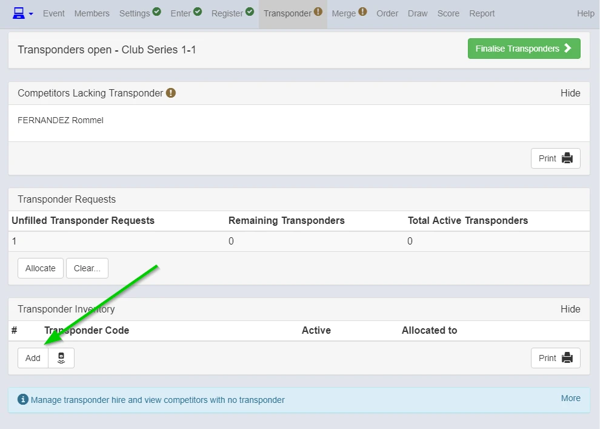
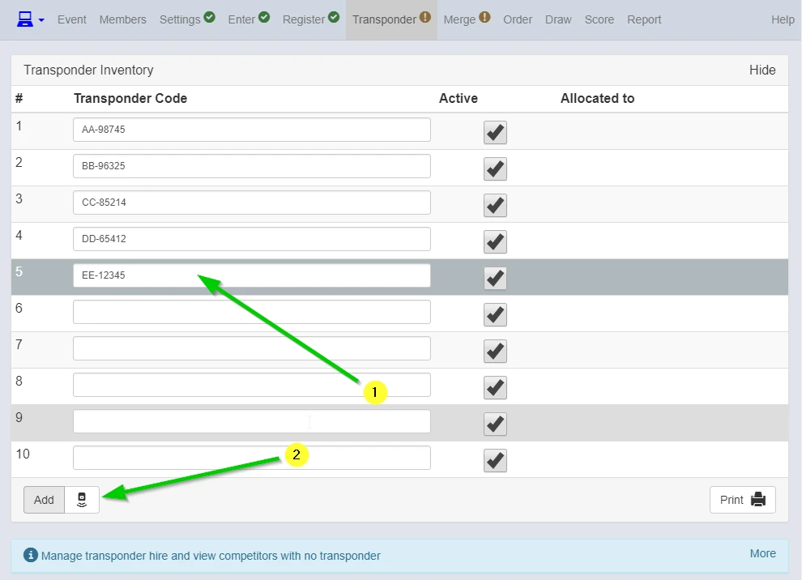
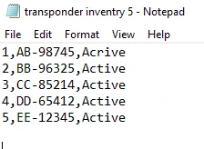
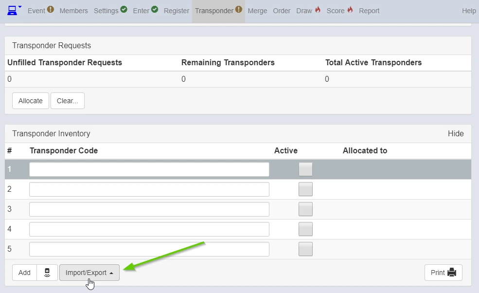
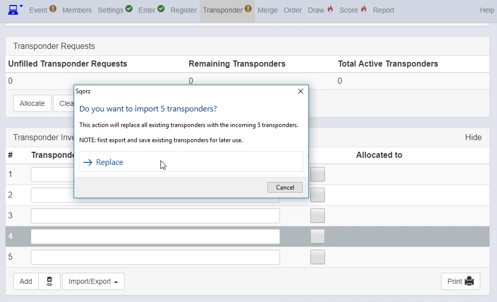
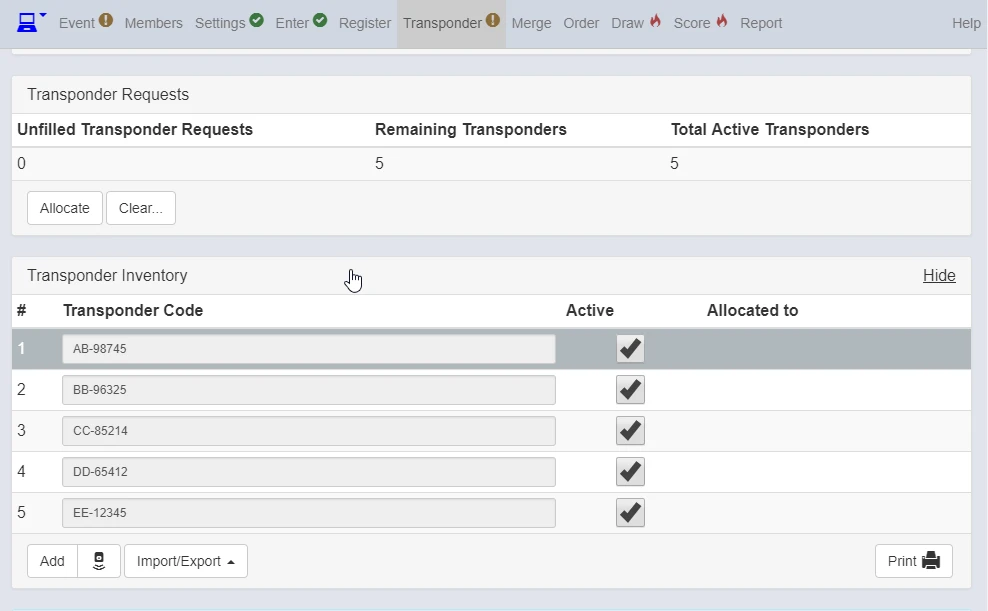
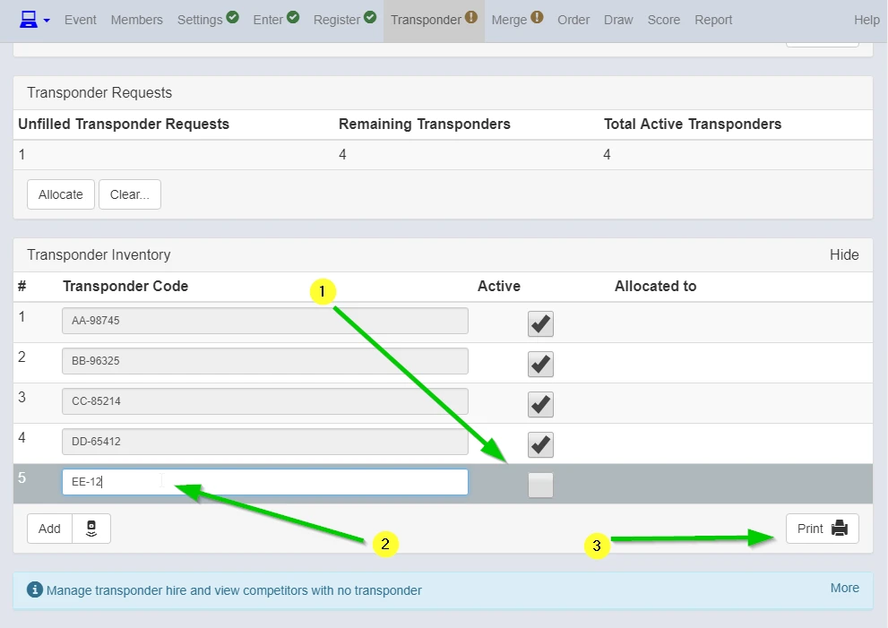

There are 3 ways for creating transponder inventory.

###1. You can manually enter transponder code.

{: style="width:500px"}

###2. Just scan Transponder if you have Self Service Centre (Checking Station).

{: style="width:500px"}

###3. Create Transponder list in txt or spreadsheet and copy it onto the clipboard.

{: style="width:500px"}

Click "Import" (You can save existing inventory by "Export" ing as well)

{: style="width:500px"}
{: style="width:500px"}
{: style="width:500px"}

When you want to modify the number,

1. Untick "Active"
2. Then modify
3. You can print Transponder Inventory too

{: style="width:500px"}

