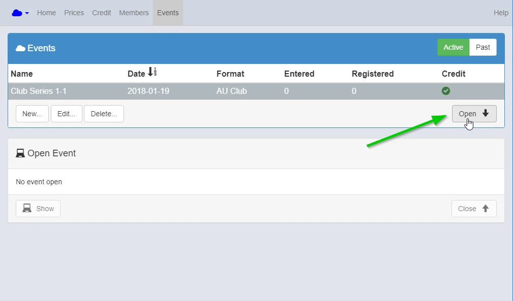

Create new event.

{: style="width:500px"}

{: style="width:500px"}

{: style="width:500px"}

Tick "Publish" to upload the event result for Our Sqorz.

{: style="width:500px"}

Go to Settings.

{: style="width:500px"}

1. Check "Load".
2. Select your Club race format you have created before.
3. Click "Load".

{: style="width:500px"}

Import Competitors with pre-entry when available. The CSV file to be used for importing riders can be found by clicking the link Generic race import file - CSV 

{: style="width:500px"}

Purchase more credits when needed. Click Done.

Make sure you have enough credits for expected riders, unused credits are saved for the next race.

{: style="width:500px"}

Highlight the event just created and click Open.

{: style="width:500px"}

Now the event is downloaded onto your club laptop and ready to take to the track.

