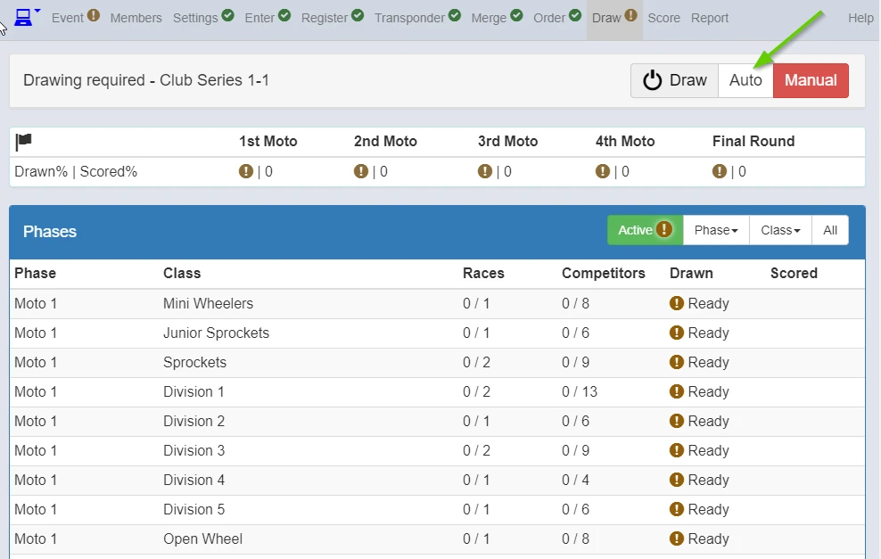
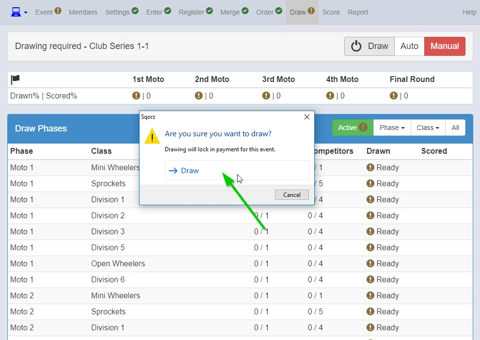
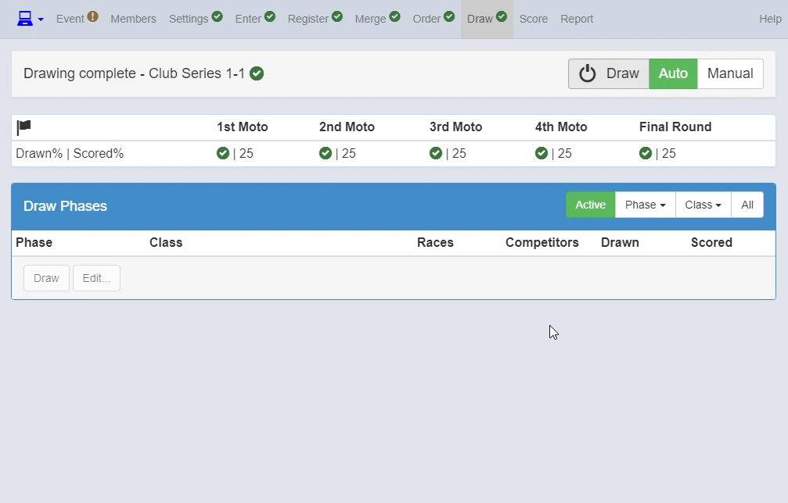
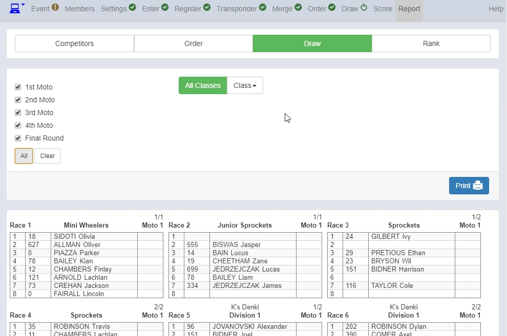

{: style="width:500px"}

Once all ready, click Auto.

{: style="width:500px"}

Clicking Draw button here means you are committed to use your credits.

{: style="width:500px"}

Report Screen to print moto sheets.

{: style="width:500px"}

1. Click Draw for Moto sheets
2. Click All 
3. Print