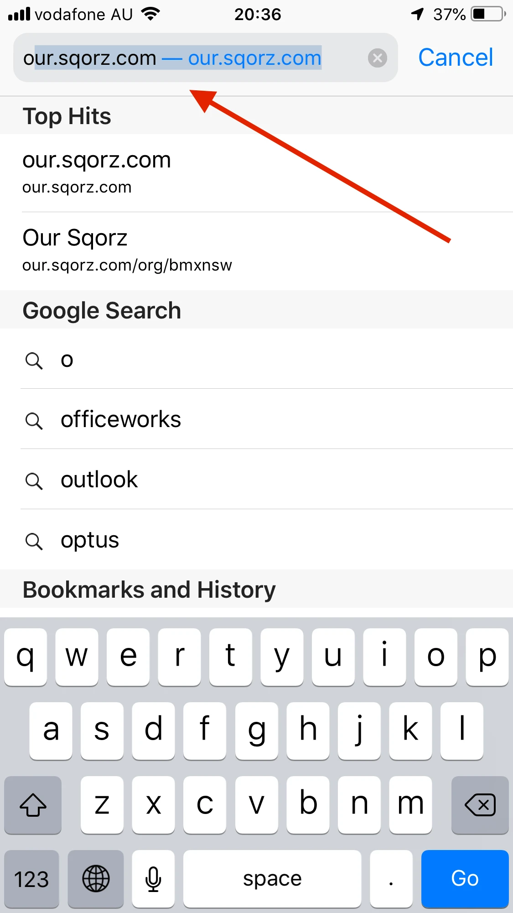
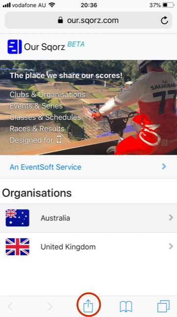
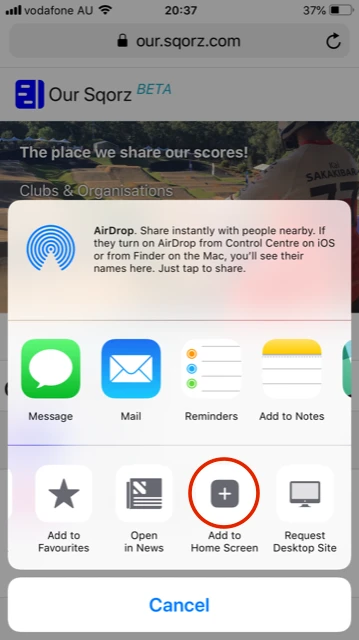
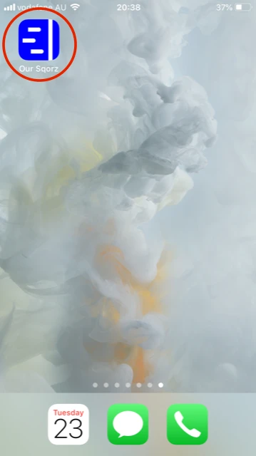
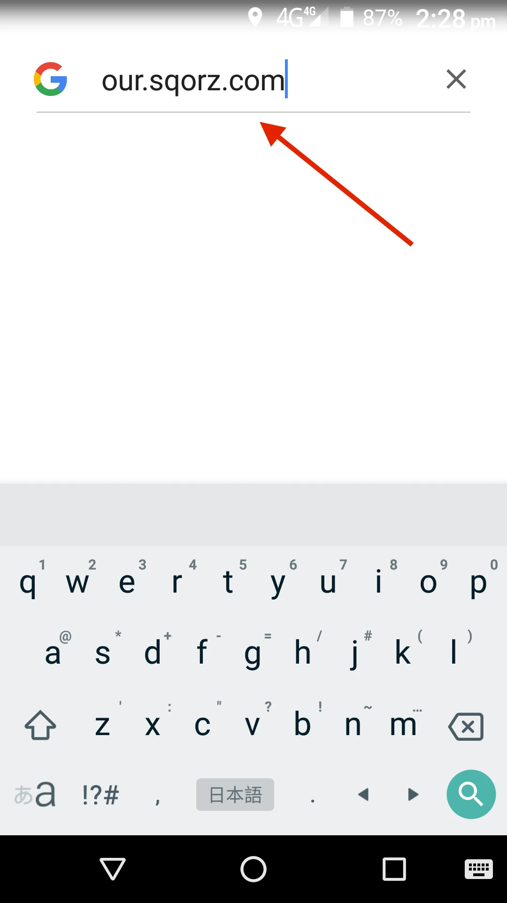
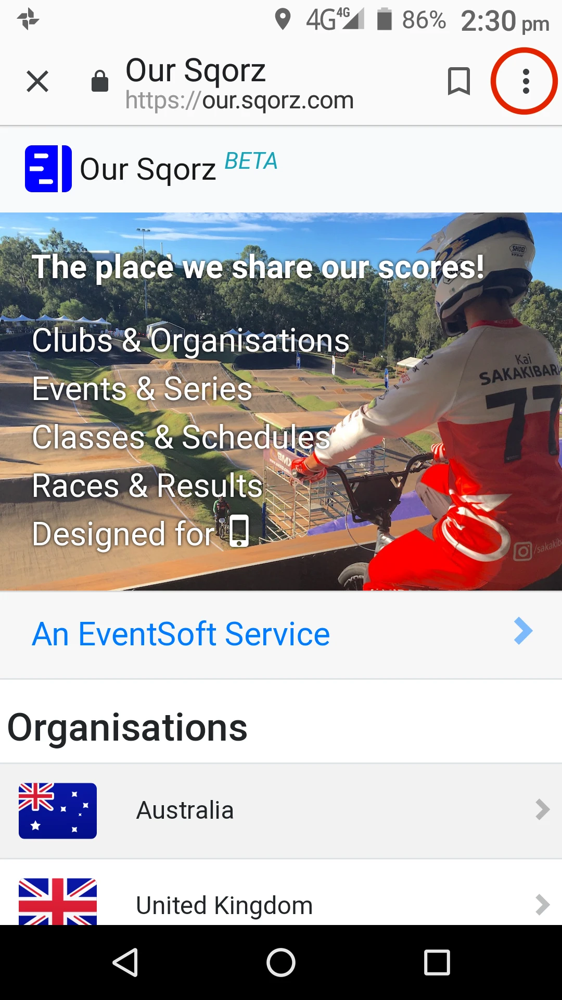
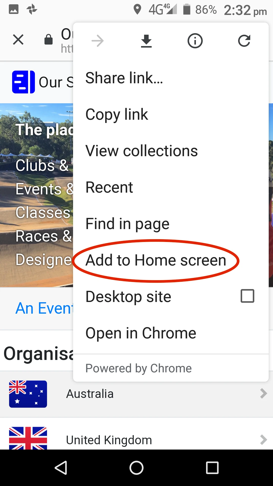
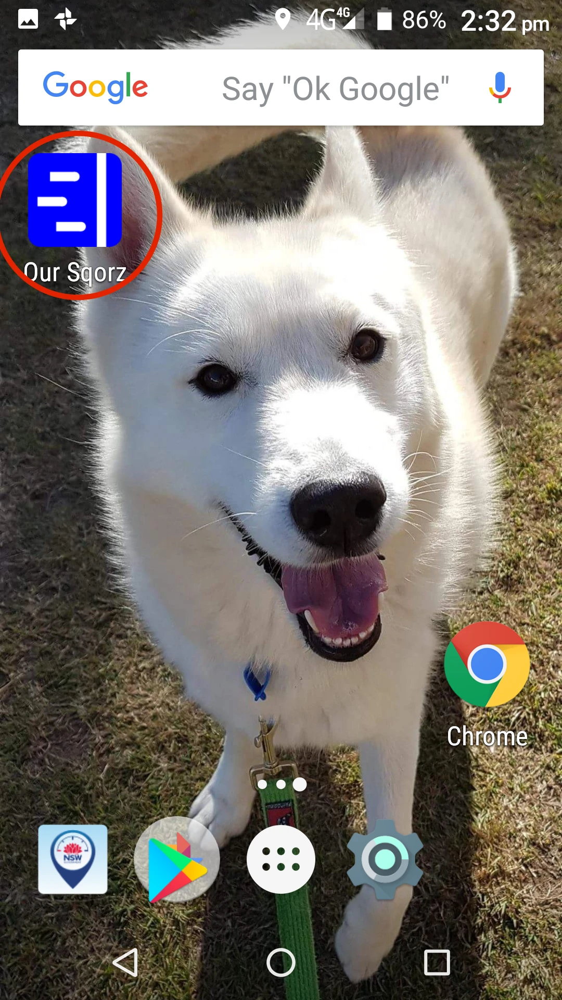

## iPhone

<table>
<thead>
<tr>
<th colspan="4">iPhone Setup</th>
</tr>
</thead>
<tbody>
<tr>
<td></td>
<td></td>
<td></td>
<td></td>
</tr>
<tr>
<td>In your browser,
type "[our.sqorz.com](https://our.sqorz.com)"</td>
<td>Tap the Share button on the menu bar</td>
<td>Tap "Add to Home Screen" </td>
<td></td>
</tr>
</tbody>
</table>
| iPhone Setup | | |
| --- | -- | -- | ---|
| {: style="width:200px"} | {: style="width:200px"}| {: style="width:200px"}| {: style="width:200px"}| 

In your browser,
type "[our.sqorz.com](https://our.sqorz.com)"

{: style="width:200px"}

Tap the Share button on the menu bar

{: style="width:200px"}

Tap "Add to Home Screen" 

{: style="width:200px"}

{: style="width:200px"}

## Android

In your browser,
type "[our.sqorz.com](https://our.sqorz.com)"

{: style="width:200px"}

Press the Menu button

{: style="width:200px"}

	
Tap "Add to Home Screen" 

{: style="width:200px"}

{: style="width:200px"}