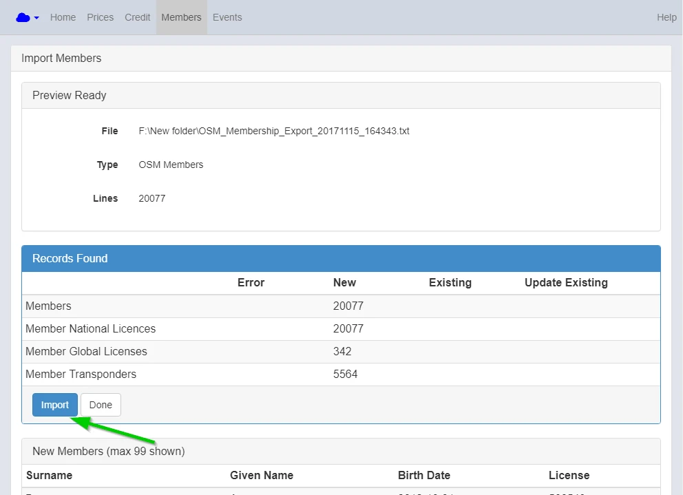

---
tags:
  - Member Database
---

!!!NOTE 

    This is for regions that are not using the database subscribe functionality.

Download the Member database from your National Organisation

Click Import Members

{: style="width:500px"}

Select Member Database file

{: style="width:500px"}

Click Import

{: style="width:500px"}

Once imported click done.

{: style="width:500px"}

