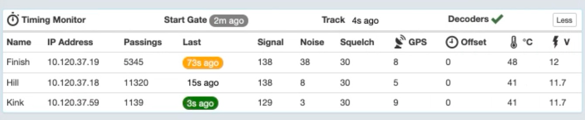
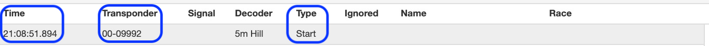

## Preamble

It is essential to check your MYLAPS system before any racing or training event. 
If everything is working correctly this should only take a few minutes. 

Early identification of issues is critical to a successful event.

!!!Warning
    The fact that the timing system worked previously does not mean it will work next 
    time — things change and things happen.
    
    **Always, always, always** do a timing system check well before the event is due to start.

The following items must be checked:

1. Decoder[s] are connected to Sqorz and the decoder clocks are correct
2. If utilised the GPS units are connected and working (2 or more decoders)
3. The start signal is coming from the gate
4. Timing loops are all working and there is minimal noise

## Timing Data screen

The Timing data screen shows every single transponder reading and start gate signal 
that it receives from the decoders. These are the raw unprocessed data.

It is essential to have this screen open when running any event because it 
provides excellent feedback to what is happening on the track.

To get this screen to show click on the ‘View’ menu on the top left of 
your screen (mac or Windows) and select ‘Zoom Out’, do this 4 times and the 
**Timing Data** screen will appear on the right.

The Timing Data (raw transponder and start gate readings) will be on the right, 
and the processed times will be shown on the left.

## Timing Monitor

- Once the decoder[s] is/are connected go to the Training or Score screen
- Zoom out (click View on the top left and select ‘Zoom out’) until the screen splits in 2.
- Click ‘More’ to open the Timing Monitor on the left side

- Check the following information:
* **Name**: is the decoder name
* **IP Address**: Is the decoder IP address
* **Signal**: shows the strength of the last signal received (ideally above 100)
* **Noise**: shows the amount of ‘noise’ or ‘interference’ on the loop (as close to zero as possible is best but should be at least under 40)
* **GPS**: if used, shows the number os satelittes connected tp the GPS, these are used for setting the clock on the decoders
* **Offset**: shows the difference in time between the decoders and the laptop if not using GPS. If using GPS this number shoud be zero
* **Temperature**: should not be above 50 degrees C

## GPS

- If there is more than 1 decoder check the GPS units are connected and working
- Check there is a number representing the number of satellites that have been detected
- Check the GPS has locked onto the satellites (round symbol is not spinning)
- Confirm the Offset is 0

## Start Signal

- Drop the start gate
- When the gate drops check the green LED flashes and the red LED stays on for 5 secs on the Start Pulse Interface box
- Check the Timing Data on Sqorz and ensure you can see the following

- **Time**: is correct
- **Transponder**: ‘00-09992’ or ‘00-09991’ (or both if your track has a 5m hill and an 8m hill), FYI the decoder sees the gate drop signal as a transponder reading
- **Type**: ‘Start’

##  Loops

- Have 1 rider ride the track slowly
- Watch the rider (or have someone watch the rider)
- Check that there are transponder signals for the rider in the Sqorz **Timing Data** as the rider goes over each of the loops
- Check the signal strength of the transponder is >100 for each of the loops

**If the decoders, GPS, start signal and timing loops are all OK then good to start the event.**

## Troubleshooting

| Issue | Action                         | Steps                                                                                  |
| --- |--------------------------------|----------------------------------------------------------------------------------------|
| No transponder reading on the Data Monitor | Check transponder battery      | <ul><li>Connect transponder to laptop via USB and open MYLAPS Connect application</ul> |
| | Check transponder subscription | <ul><li>Put transponder number in mylaps.sqorz.com.<li>Check subscription status</ul>  |
| | Check decoder is on            | <ul><li>Screen on the front of the decoder is on<li>Is connected to Sqorz</ul>         |
| | Check loops and cables         | <ul><li>All connected and no breaks <li>Specially check man-made connectors</ul>       |
| No gate reading on the Data Monitor | Check start pulse box          | <ul><li>Does the green light flash when the gate drops</ul>                            |

