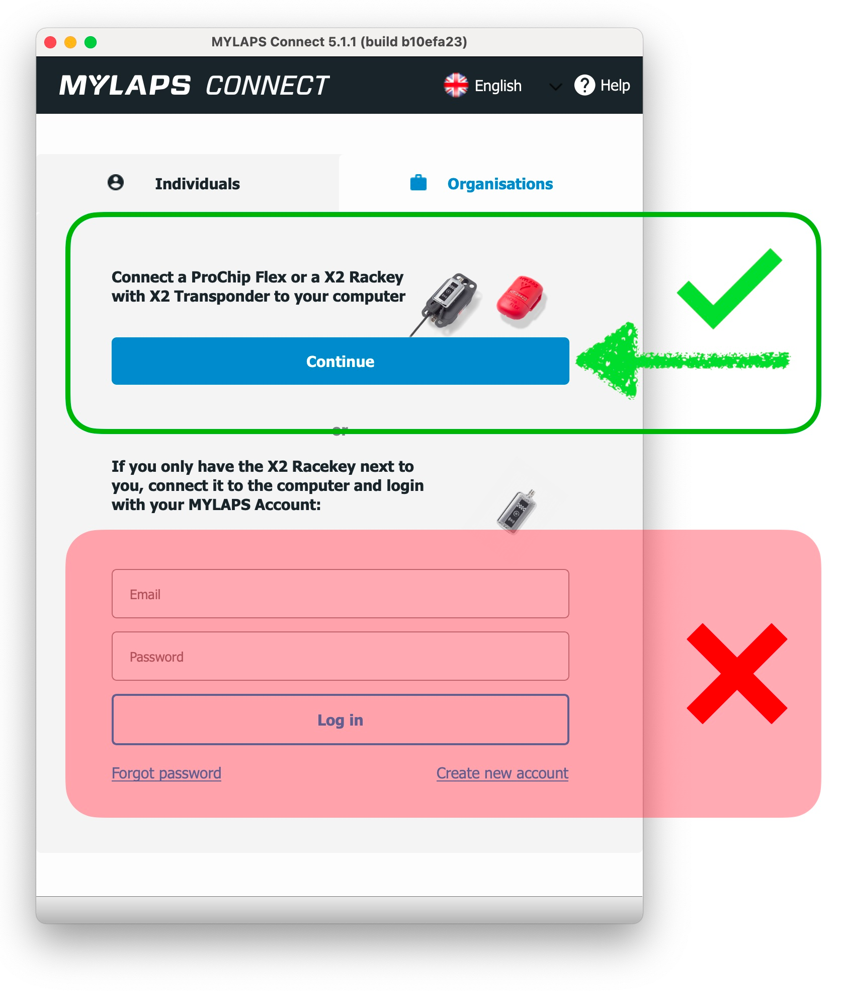
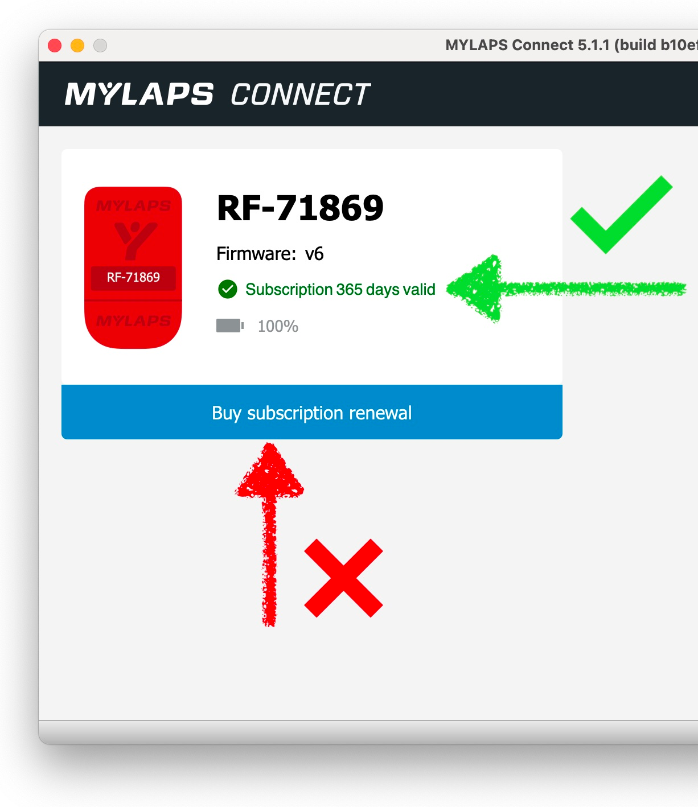

MYLAPS transponders need an active subscription in order to operate. 
The subscription process has two parts:

1. Purchase the subscription
2. Activate the subscription on the transponder

---

## Process

1. Purchase a subscription for 1, 2 or 5 years from [mylaps.sqorz.com](https://mylaps.sqorz.com) 
2. Activate the subscription by following these steps:
    - Download MYLAPS Connect for ProChip Flex onto your computer (macOS or Windows).
    - Open MYLAPS Connect
    - Click the 'Continue' button in MYLAPS Connect (NOTE: there is no need to create an account)

- Connect the transponder to your computer via USB port

- Ensure the subscription has been updated
- Make a note of the subscription date in your calendar