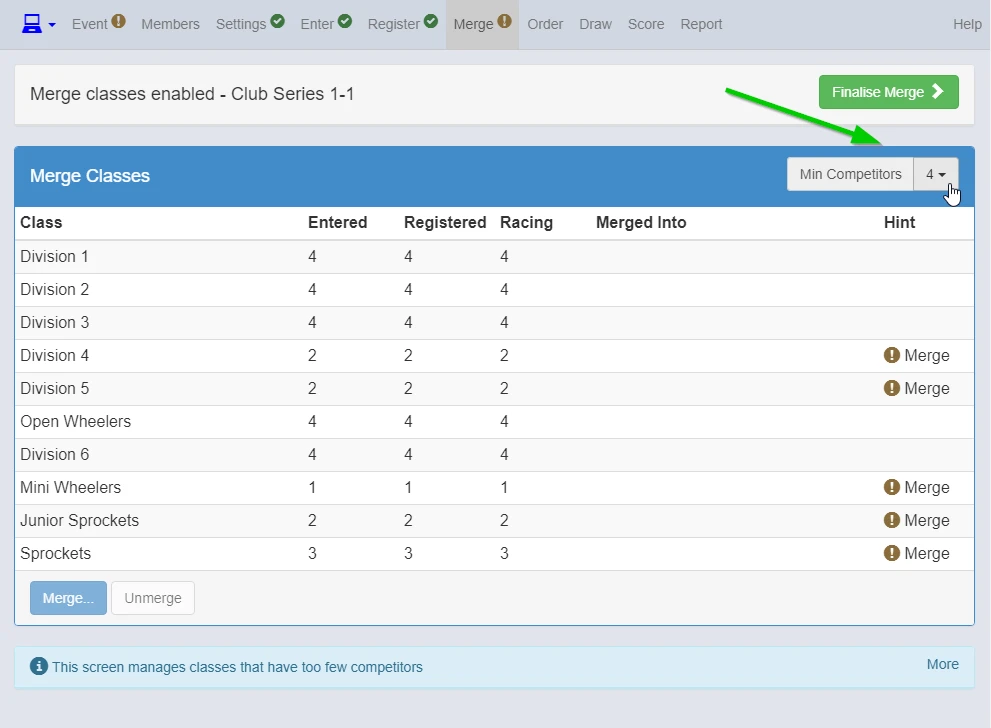

##Merge Screen

{: style="width:500px"}

The Min Competitors setting is used to calculate whether a class needs to be merged or not.

{: style="width:500px"}

1. Select the division you want to merge.
2. Click Merge (Or Enter)
3. Select the division you want merge into

{: style="width:500px"}
{: style="width:500px"}

Once you finish merging click Finalise Merge.
