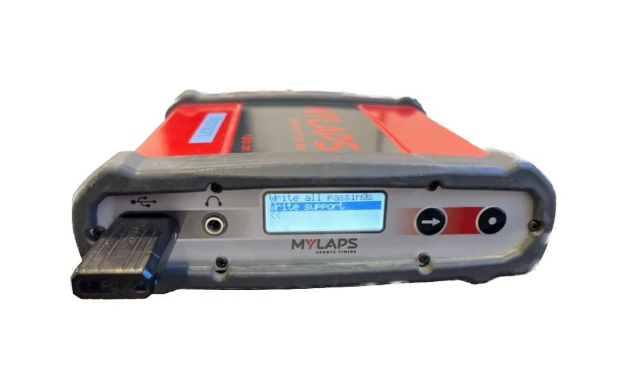
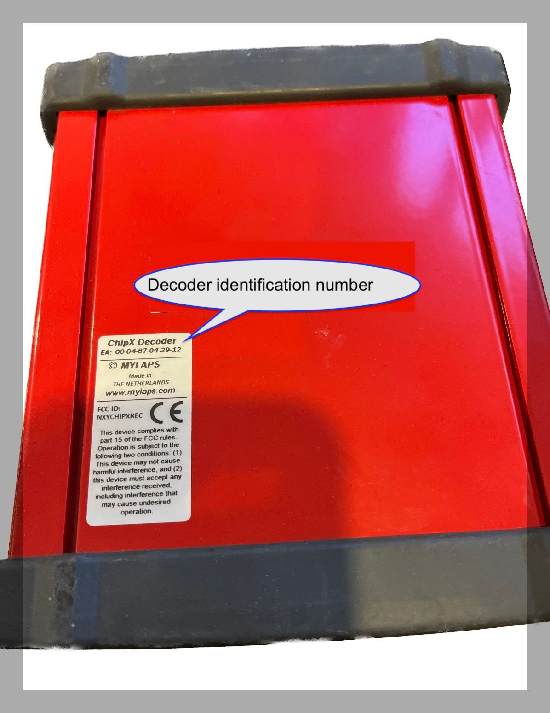

In order to troubleshoot issues with the red Chip-X decoder MYLAPS will need the 
decoder log file and the decoder ID number.

## Obtain the decoder log file

- Switch on the decoder
- Plug a USB stick in the USB port at the front of the decoder
- A menu will appear on the decoder.
- Press the button with the arrow on it to highlight 'Write Support’
- Press the button with the dot on it to copy the support logs to the USB drive
- Remove the USB drive, copy the log file to an email to send.

## Decoder ID 

Take a photo of the label on the underside of the decoder and send along with the log file.

