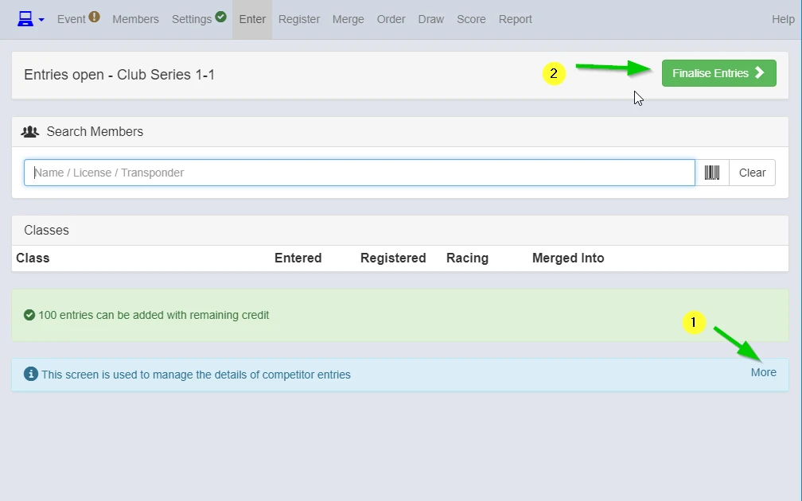
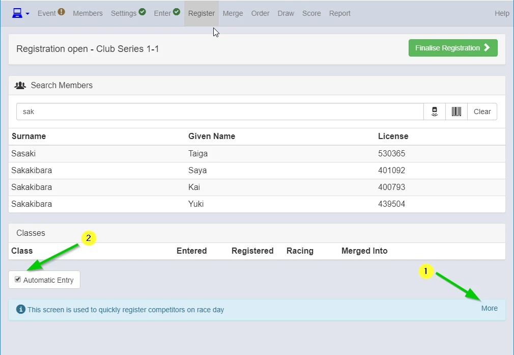
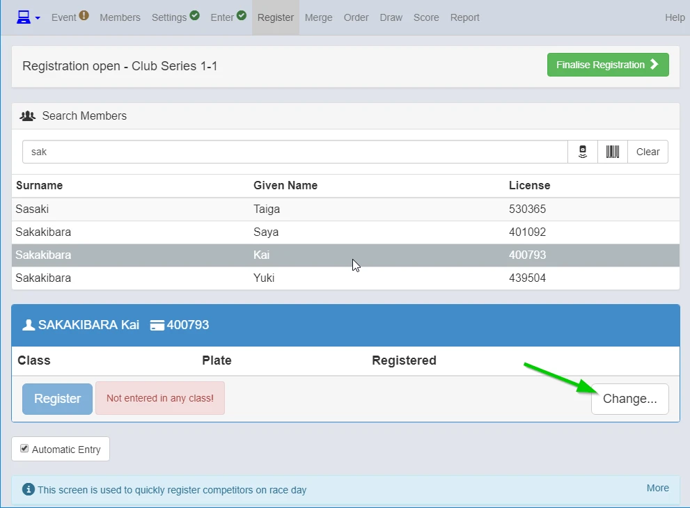
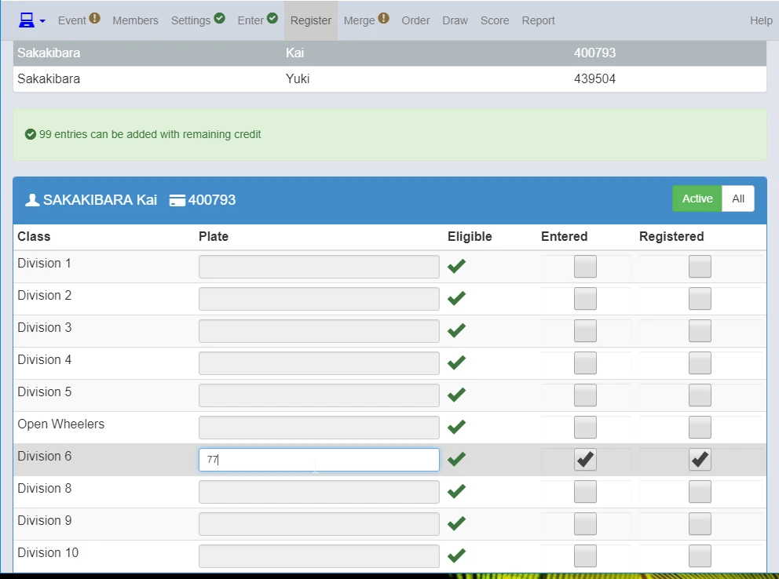
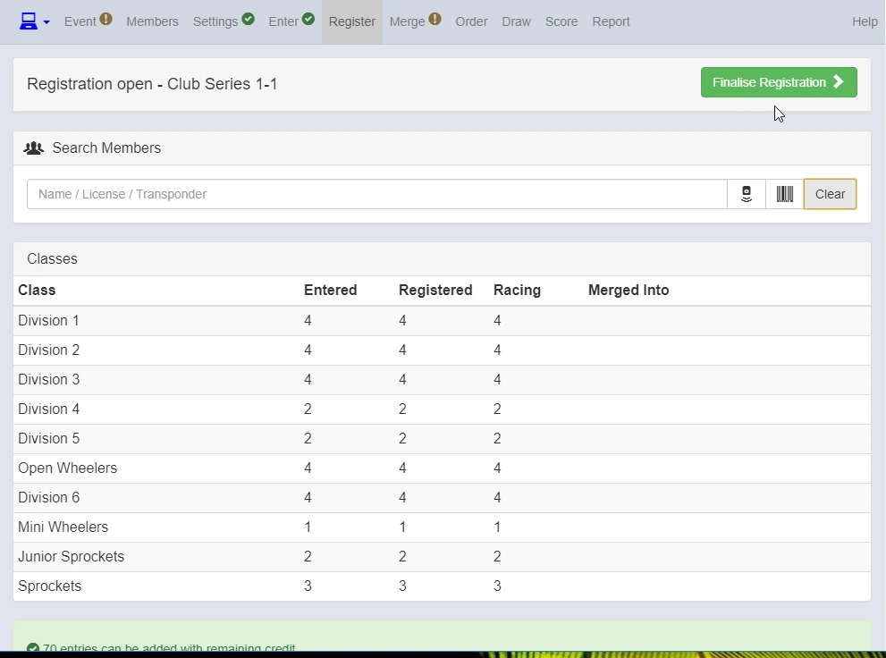

Enter Screen

{: style="width:500px"}

You can learn more about this screen here.
This screen is for working with online entries, if there are no online entries "Finalise Entries" and go to Register screen.

###Register screen

{: style="width:500px"}

Search members from any combination of Family Name, First Name, License Number and Transponder number.

1. Learn more about this screen here.
2. Automatic Entry box needs to be checked (Sqorz will remember competitor class and plate number from the last event entered).

You can register competitors using barcode scanner as well.

7-1. Setup Barcode Scanner for registration

{: style="width:500px"}

{: style="width:500px"}

Enter and register competitors to suitable club division and type plate number.

{: style="width:500px"}

Once you enter and register all riders for the event, "Finalise Registration".