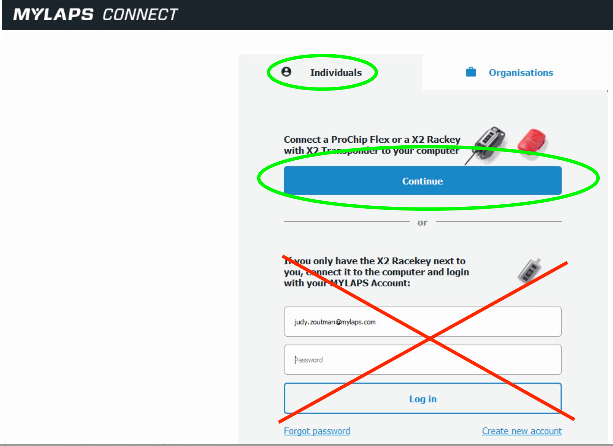
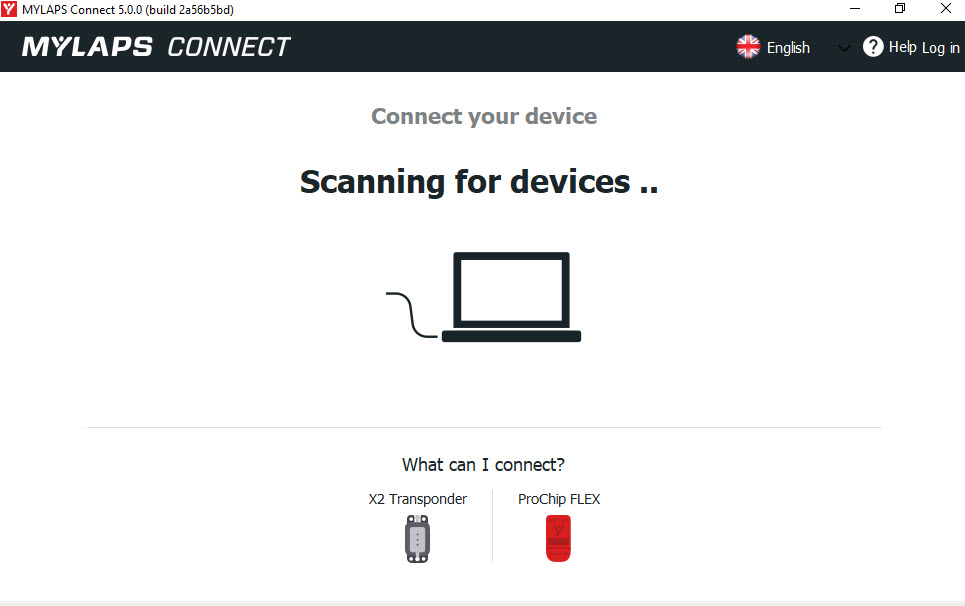
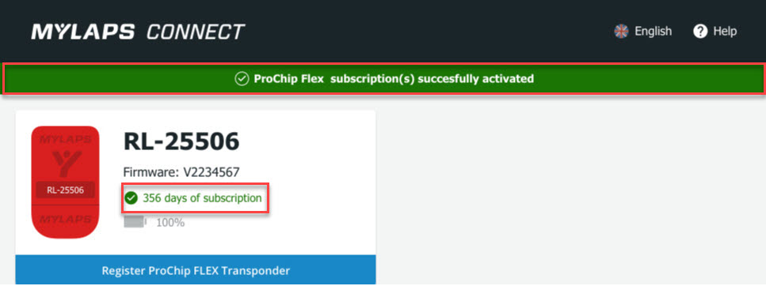

## MYLAPS transponder subscription activation process

Subscription renewal of MYLAPS transponders has 2 steps:

1. Renew the subscription
2. Activate the subscription

### Renew the Subscription
Subscription renewal can be done via here [mylaps.sqorz.com](https://mylaps.sqorz.com)

!!!Note
    New transponders already have a 1-year subscription included however,
    this subscription is dormant until **Activated**.

### Activate the Subscription

After you have renewed your subscription you need to activate your subscription
with the software [MYLAPS Connect](https://help.mylaps.com/s/download-software?language=en_US).

1. Download and open [MYLAPS Connect](https://help.mylaps.com/s/download-software?language=en_US) 
2. Click on <Individuals> and on <Continue>
3. Plug in the transponder to the USB port on your computer
4. The transponder should automatically activate with the subscription
5. Check the green text for days remaining on subscription

!!!NOTE: 
    There is no need to create a login.

Open MYLAPS connect, select <Individuals\> and <Continue\>

Take off the cap and connect the transponder in the USB port of your computer.
Once the transponder is connected, you see an overview of your transponder.

As soon as you see a green bar the subscription of your transponder is activated.

The green text shows how many days of subscription are remaining.

We recommend you set a reminder on your phone 1 week before the subscription ends
so you can renew it in time.

### Any Issues

If you experience any issues with your transponder then contact MYLAP directly on the following link 
[https://help.mylaps.com/s/support-athlete-racer?language=en_US](https://help.mylaps.com/s/support-athlete-racer?language=en_US).