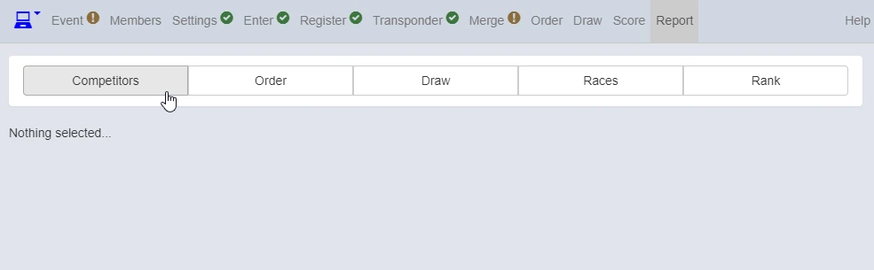
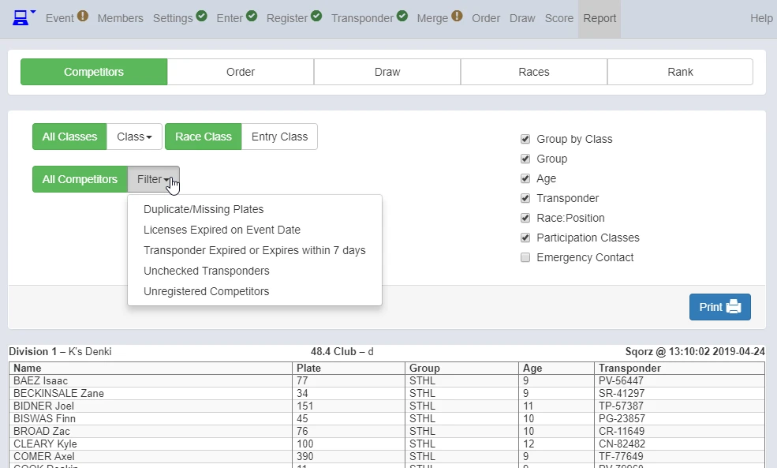

You can have various kinds of lists from "Report" screen including

- Duplicate/Missing Plates
- Licenses Expired on Event Date
- Transponder Expired or Expires within 7 days
- Unchecked Transponders
- Unregistered Competitors

Click "Competitors"

{: style="width:500px"}

Click "Filter"

{: style="width:500px"}

All reports are printable.
