Just before the race starts, click "Auto"

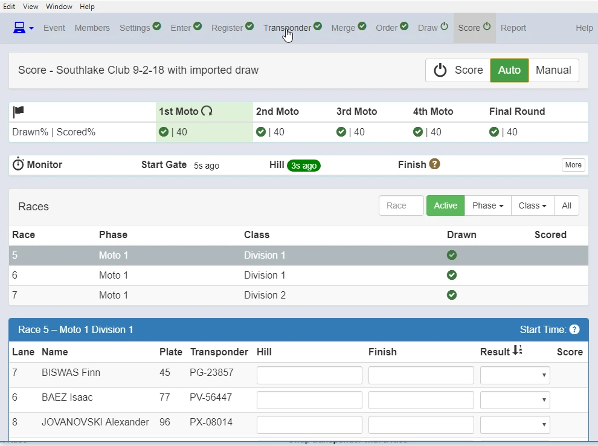{: style="width:500px"}

You will see the arrow rotating next to "1st Moto".

"Monitor" will show you when first transponder passed Gate, Hill and Finish.

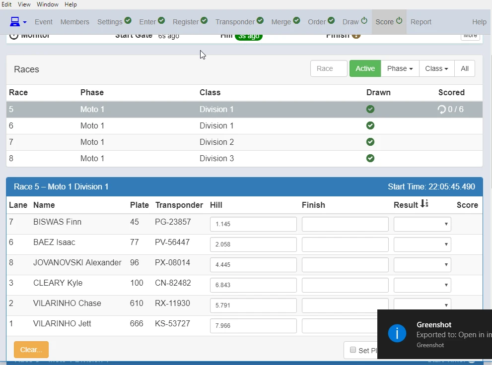{: style="width:500px"}

Once the race starts, you will see the arrow rotating.

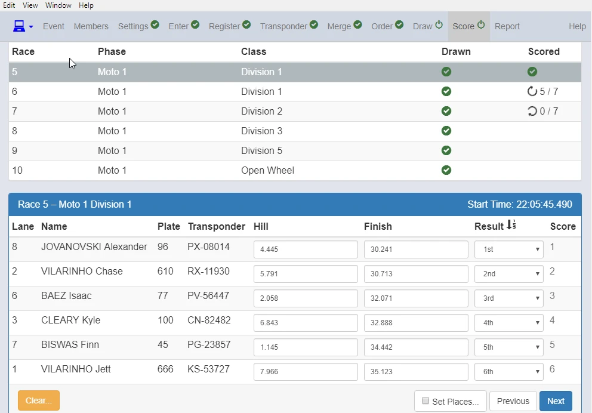{: style="width:500px"}

When all competitors got scored by time, click "Next".

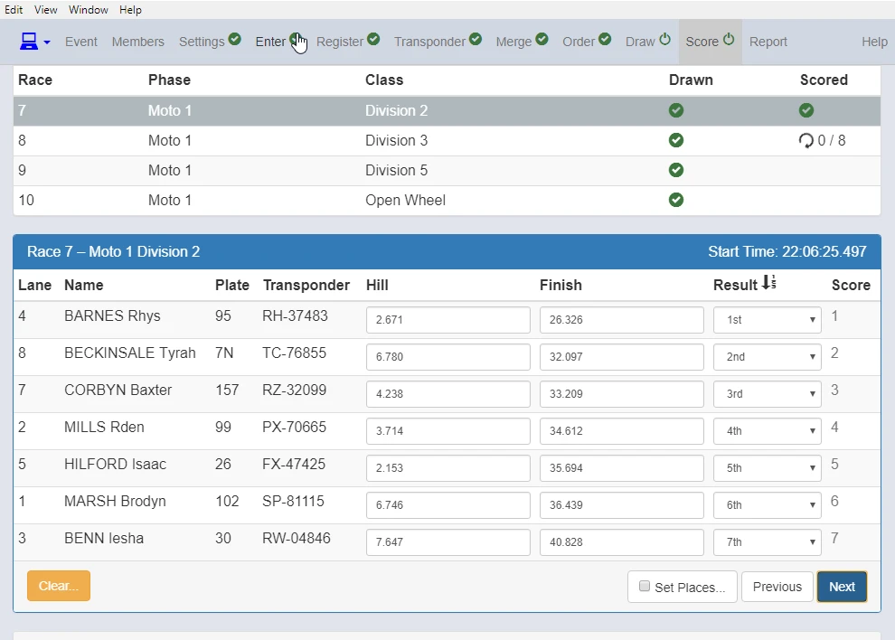{: style="width:500px"}

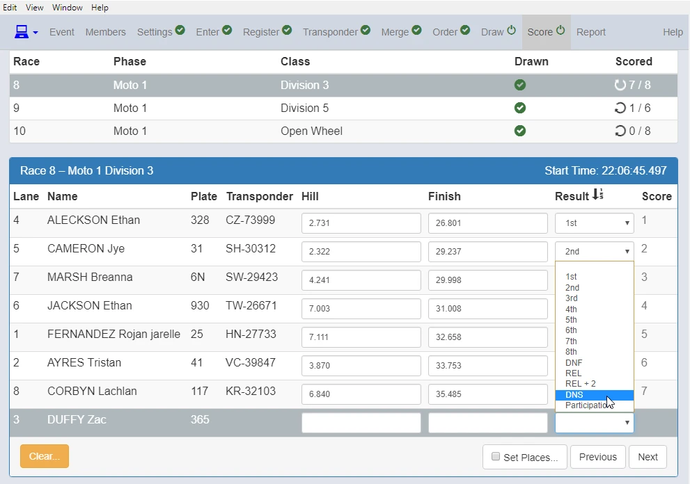{: style="width:500px"}

For the competitor without transponder or with transponder not correctly working,

DNF is scored Automatically when it's set so.

Otherwise, score competitors manually from pull down menu accordingly.

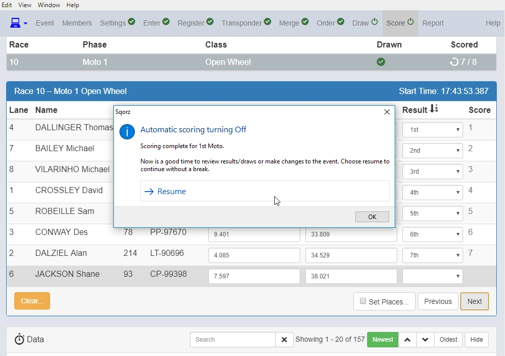{: style="width:500px"}

When all 1st moto finished, Automatic scoring turns off.

This is a good opportunity to change or check details/divisions etc. of competitors if needed.

Click "OK" to make changes. 

If you want to continue, just click "Resume".

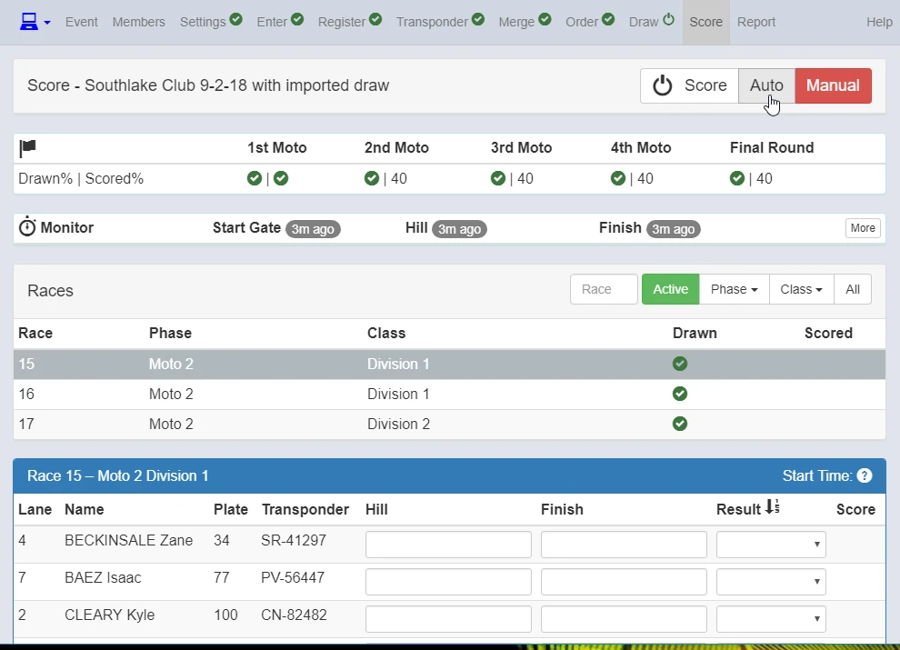{: style="width:500px"}

!!!Note
    Don't forget to click "Auto" back again before Moto 2 (each moto) starts.

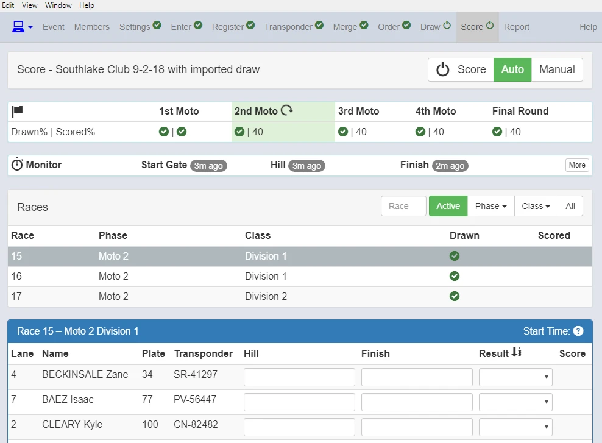{: style="width:500px"}

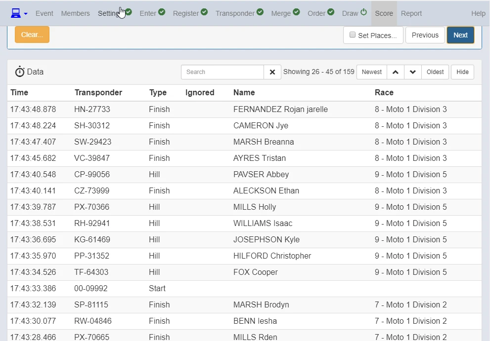{: style="width:500px"}

Scroll down to see all the passing data.

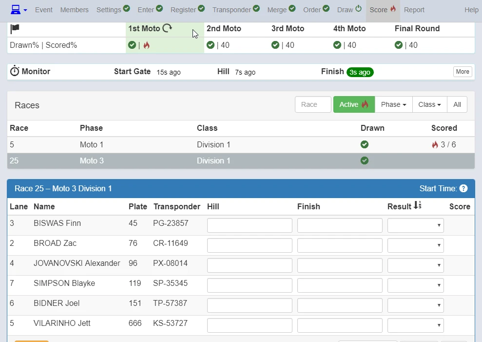{: style="width:500px"}

When you see the FIRE symbol, it means something is happening you need to go and fix.

In this case you have to go to check Race 5, Moto 1, Division 1.

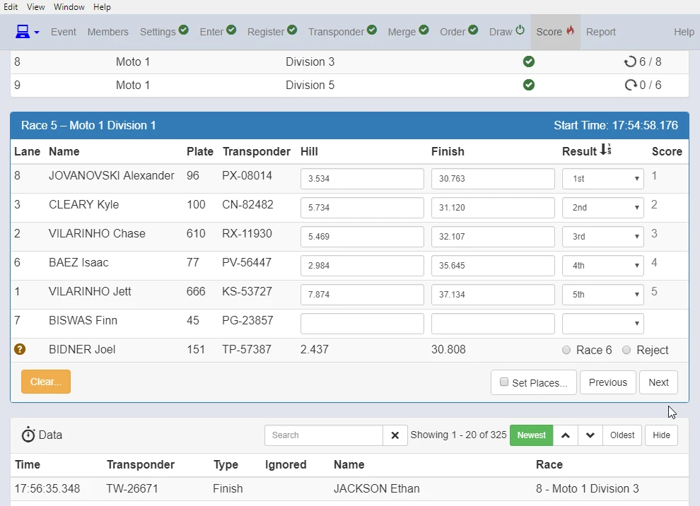{: style="width:500px"}

You can see that Joel Bidner who supposed to be in Race 6 raced in Race 5.

You have to select he will be scored in Race 6 or Reject the result.

This time "Reject" Joel's result.

{: style="width:500px"}

"DNS" Finn Biswas then Next.

When all races finish, Click "Finalise Event".

