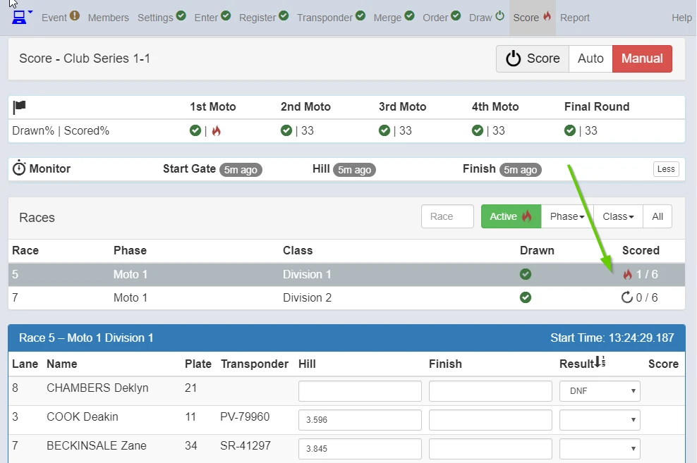
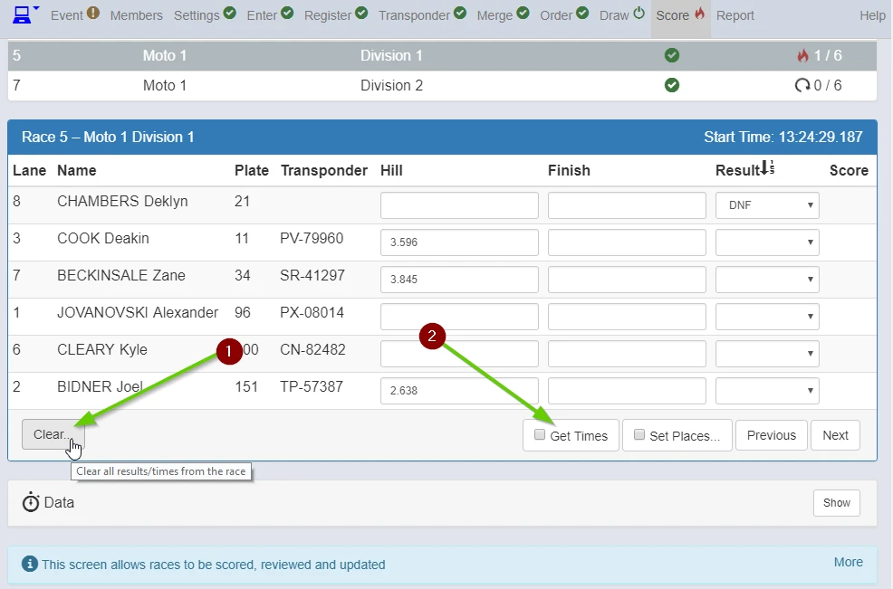
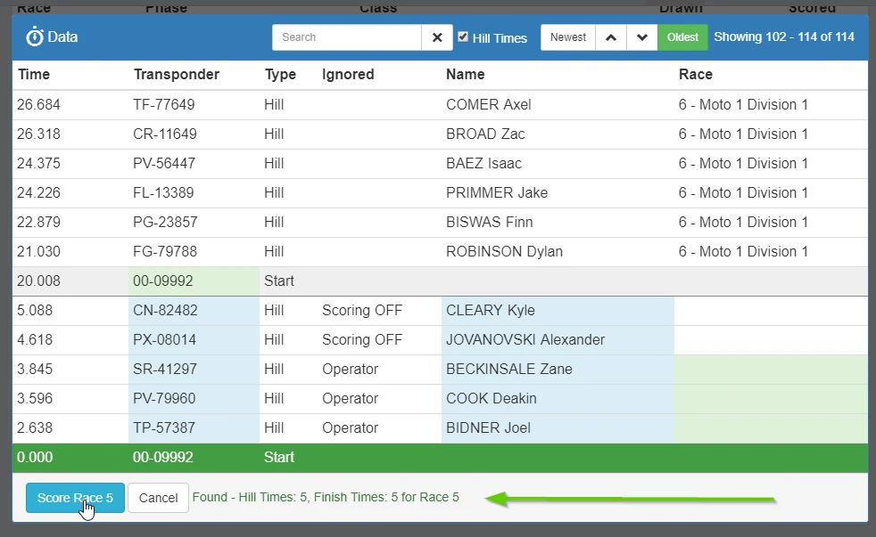
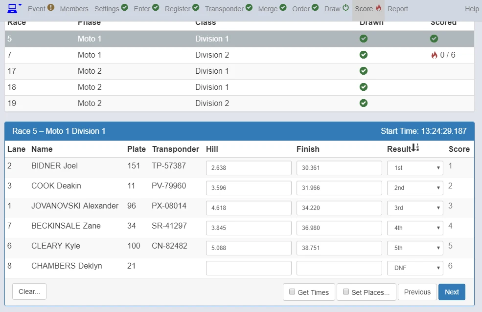
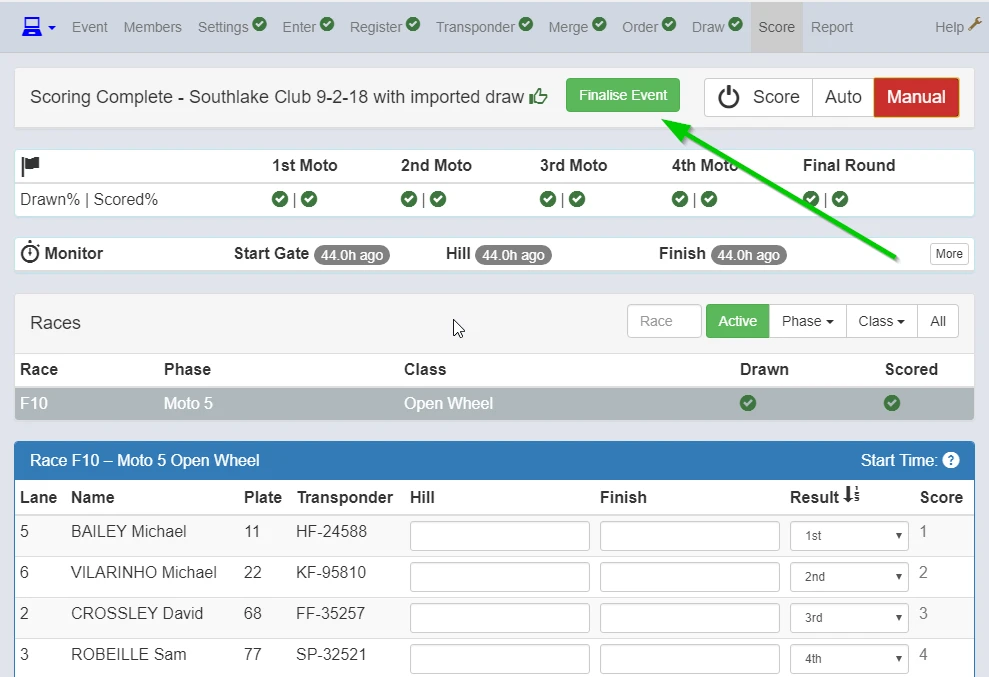

Get Times is a very useful function.

It is used to re-score races if you forget to turn "Auto" on or for any other timing problem.

Highlight the race you want to fix. Click **Get Times**.

Scroll Up and Down or use the arrows and look for the "Start" for Race 5. 

Check the time on the left hand side to make siure you have the correct start.

Once you find & highlight the Start for Race 5

Check the information in green at the bottom to check you have the expected number of Hill and Finish times

Click "Score Race 5"

Race 5 is scored.

