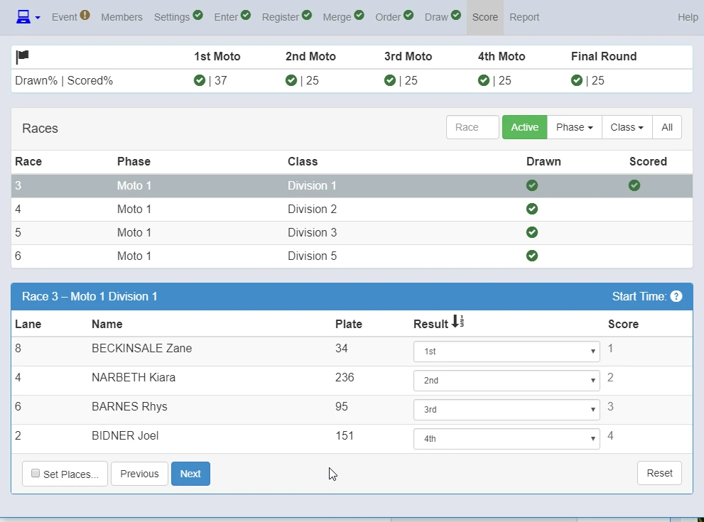

##Score screen

{: style="width:500px"}

{: style="width:500px"}

Highlight the Race you want to score.

{: style="width:500px"}

1. When Set Places is ticked,
2. Place results by clicking anywhere in each competitors row.

{: style="width:500px"}

{: style="width:500px"}

You can score from pull down menu.  

{: style="width:500px"}

1. Once scored,
2. Click next and continue scoring.

{: style="width:500px"}

When you finished scoring all races, "Finalise Event".
