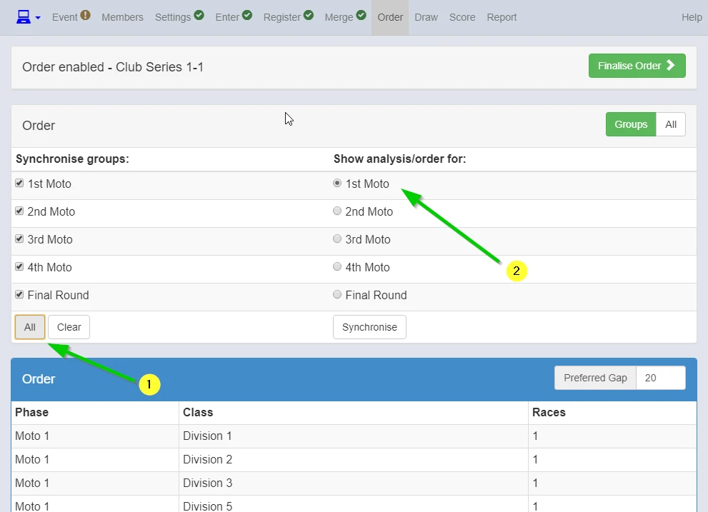

{: style="width:500px"}

Click here to learn about this screen.

{: style="width:500px"}

1. When order of all motos are same, click All.
2. Click moto you want to check. (any moto is OK if the order is the same for all motos)

{: style="width:500px"}

Set the race order. Click "Move" then click desired order or use arrows.

Once you set the order,  "Finalise Order".

Go to Report screen to print race order if required.

{: style="width:500px"}

{: style="width:500px"}
