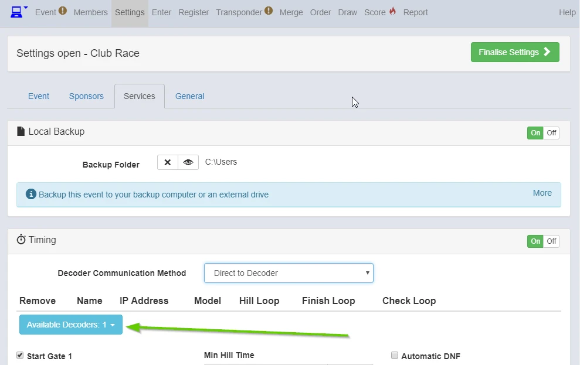
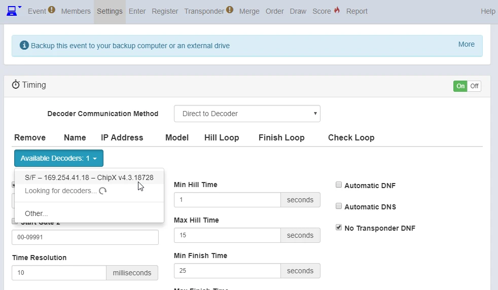
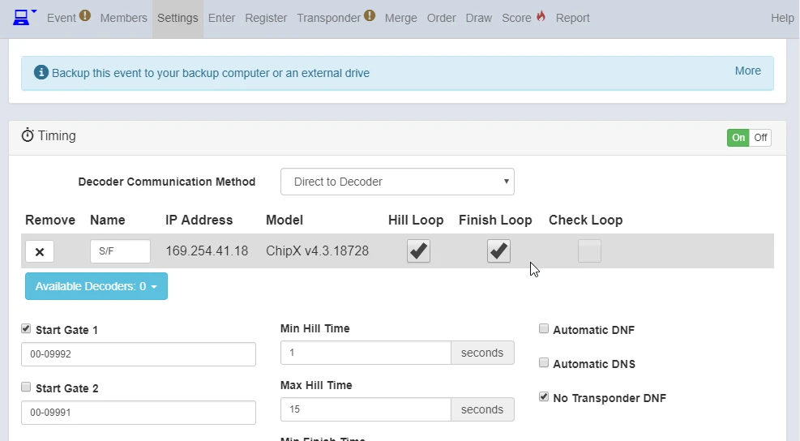
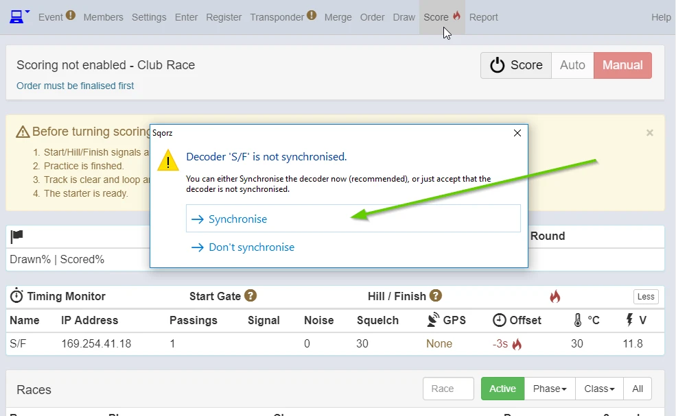
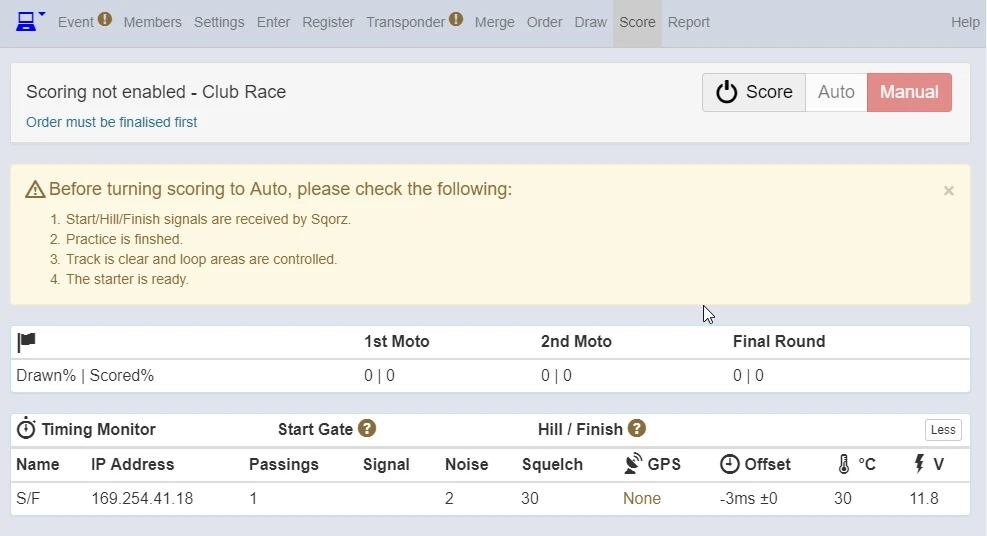
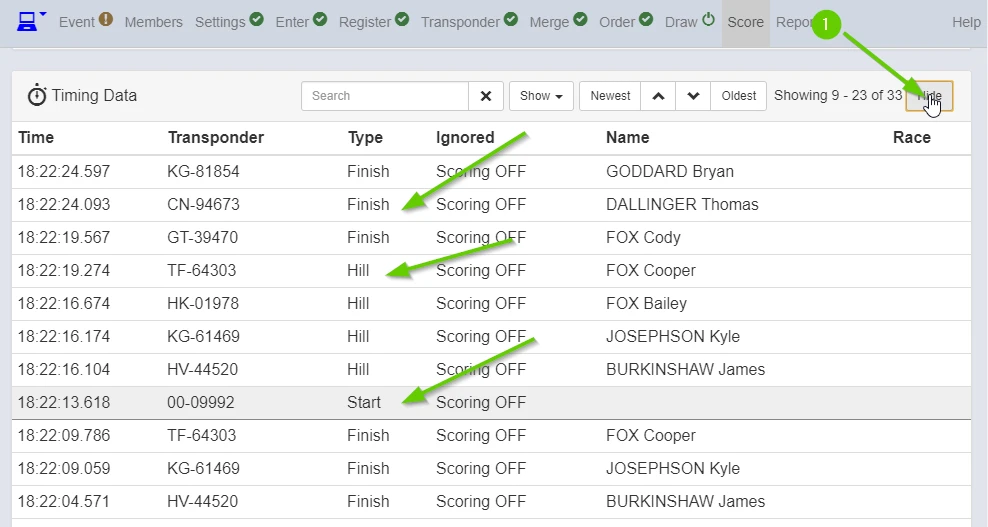

Go to Settings > Services

Once you set your network right, you can see your decoders here.

{: style="width:500px"}

Select your decoder(s). 

{: style="width:500px"}

Tick your loop(s).

{: style="width:500px"}

Once you connect your decoder(s), go to Score.

If you don't have GPS for your decoder(s), Sqorz advise you to "Synchronise" the 
decoder time to your PC time. Click "Synchronise".

{: style="width:500px"}

Synchronised.

{: style="width:500px"}

Now you can see the passings data in Timing Data. 

1. Click "Show".
2. Check if you can see all "Start", "Hill" and "Finish" data are coming into Sqorz.

{: style="width:500px"}

