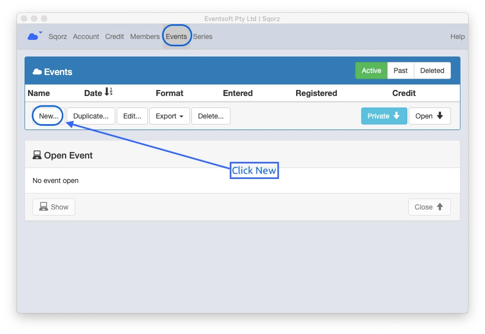

You need to create a dummy event in order to setup your race format initially.

Create a new event

Go to the Events tab and select New

{: style="width:500px"}

Select the club template

{: style="width:500px"}

Set name and date

{: style="width:500px"}

Go to Settings

Venue: set the number of lanes

{: style="width:500px"}

Race Format: set the number of motos

{: style="width:500px"}

Race Format: settings for finals

{: style="width:500px"}

Set the classes

{: style="width:500px"}

Class settings

{: style="width:500px"}

1. Click "Enabled" to show divisions.
2. Create "Class ID" for your club divisions (this is used by Sqorz to determine series results, 
it only needs to be a few characters)
3. Name your club divisions.
4. Put "Age", "Gender", "Type" of bikes in the class (The Type is used to determine the transponder 
to be used for the race, it is important to get this right)

!!!NOTE 
    The club divisions order will become the default race order setup. 
    So create divisions in order of your normal race (note this can be changed on the Order screen)

Remember non-scored classes go in the Club Participation section.

{: style="width:500px"}

Click Sponsor tub to type Class Sponsors if required.

{: style="width:500px"}

Set General information for your race. You can change them anytime.

{: style="width:500px"}

Check Save and type a name for your club format, then Save.