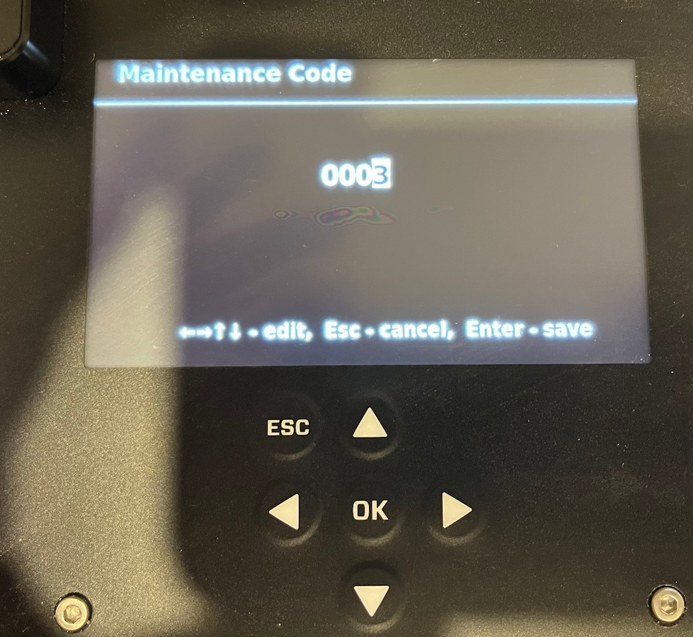
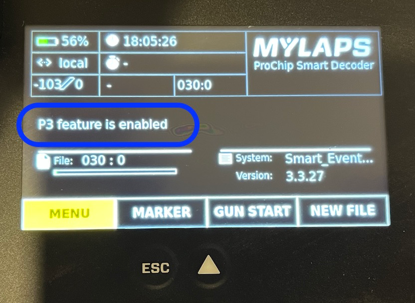
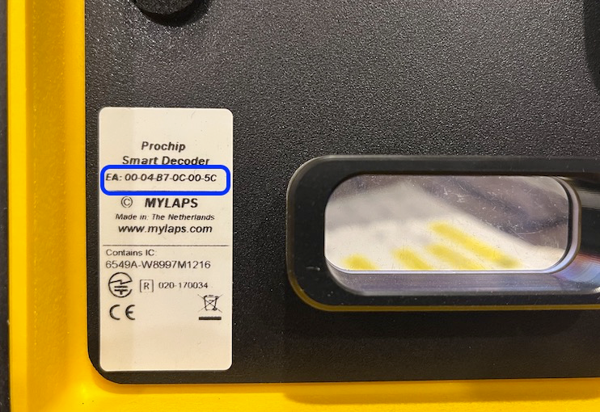
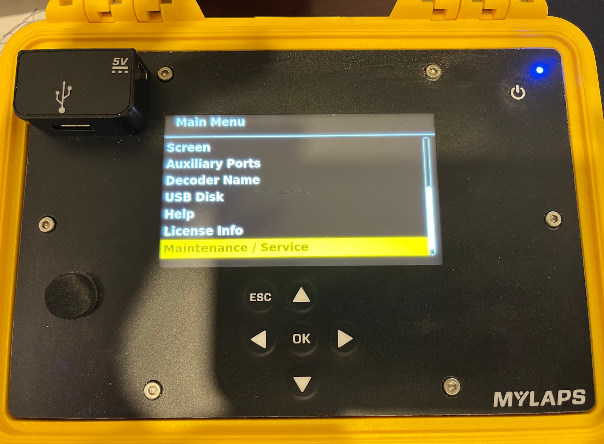
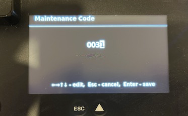
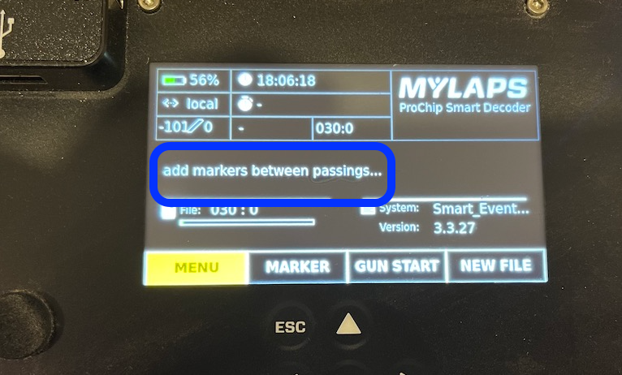
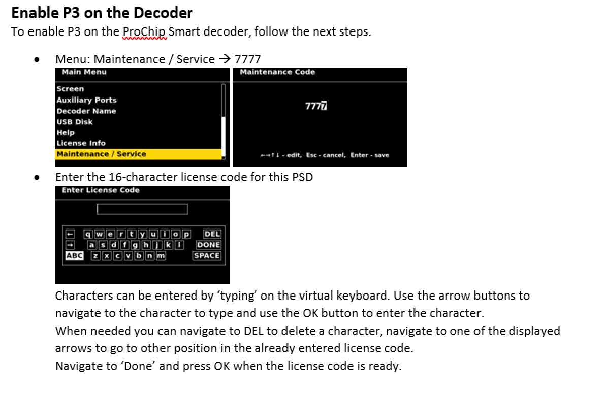

## Preamble

The Smart decoder is a nice little unit which for the most part behaves in a very similar
fashion to its red counterpart the ChipX decoder.

However, there are a couple of settings you need to know about which sit under
‘Maintenance Codes’. One of these is connecting the decoder to Sqorz, the other
is enabling the function that recognises the start signal.

## Connecting to Sqorz
If you have a new Smart decoder and Sqorz is not picking it up there is a strong 
possibility the P3 protocol has not been enabled by MYLAPS.

The P3 protocol is used to connect to Sqorz and pass information through.

To check if P3 protocol has been enabled:

- Click the OK button
- Click the down arrow until you get to Maintenance/Service

- Go to Maintenance/Service
- Click the OK button
- Enter the number 0003

- Click the OK button
- This will take you to the home screen where you will see P3 feature is enabled

- P3 feature enabled
- If the P3 text is not there you need to escalate to MYLAPS
- MYLAPS will ask for the MAC address, this can be found on the label inside the lid

## Start Signal

If there is no start signal getting to Sqorz then there is a possibility
the start signal feature has not been enabled

To fix this:

- Click the OK button
- Click the down arrow until you get to Maintenance / Service

- Go to Maintenance/Service
- Click the OK button
- Enter the number 0031

- Select 0031
- Click the OK button
- This will take you to the home screen where you will see “add markers between passings” briefly 

- add markers between passings
- and Bob’s your uncle
- Enabling P3 on the Smart decoder

