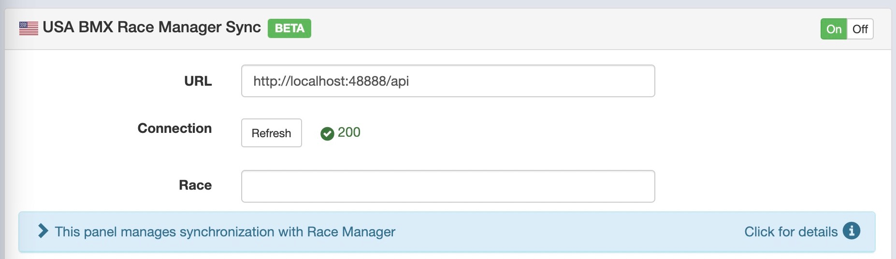
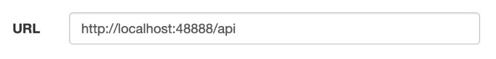
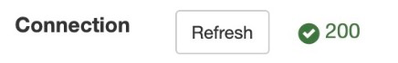
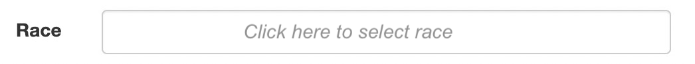
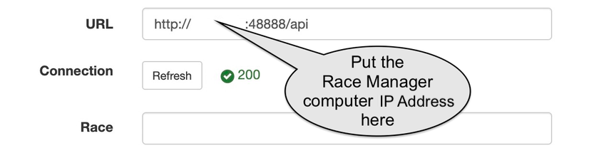

{: style="width:500px"}

Sqorz needs to connect to Race Manager in order to retrieve a list of riders for timing.

On the settings screen USABMX Race Manager Sync needs to be On

## Setup API Connection (Sqorz is on the same computer as Race Manager)

If Sqorz is running on the same computer as Race Manager the URL needs to be as shown below

{: style="width:500px"}

Click the Refresh button and you should see a green check mark and the number 200

{: style="width:500px"}

Then click on the drop down list and select the race

{: style="width:500px"}

## Setup API Connection (Sqorz is on a different computer from Race Manager)

If Sqorz is running on a different computer from Race Manager the URL will need to point to the Race Manager computer. The Sqorz computer and the Race manager computer must be on the same network.

There are 2 ways to do this:

1. Using the Hostname of the Race Manager computer (preferred method)
2. Using the IP Address of the Race Manager computer

### To obtain Hostname of the Race Manager Computer
Open a *Command Prompt (CMD)* in Windows: 

- Open the Start menu or press the Windows key + R. 
- Type cmd or cmd.exe in the Run command box. 
- Press Enter.

A black Command Prompt box will appear

Type “hostname” in the Command Prompt box and press Enter

The hostname of the computer will appear

Copy the hostname

In the URL replace the words “localhost” with the hostname obtained from the Command Prompt screen

{: style="width:500px"}

Click **Refresh** and select the event from the dropdown list

## To obtain IP Address of the Race Manager Computer
Open a Command Prompt (CMD) in Windows: 

- Open the Start menu or press the Windows key + R. 
- Type cmd or cmd.exe in the Run command box. 
- Press Enter.

A black Command Prompt box will appear

Type “ipconfig” in the Command Prompt box and press Enter

The network details of the computer will appear

Find the hostname

In the URL replace the words “localhost” with the IP Address obtained from the Command Prompt screen

{: style="width:500px"}

Click **Refresh** and select the event from the dropdown list
