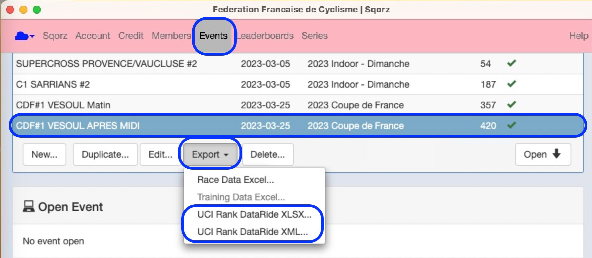

# Preamble

The Dataride report is produced after any UCI Championship event and uploaded 
to the UCI Dataride website by the PCP (President of the Commissaires Panel).

Sqorz pulls the relevant information from the website and populates the report.

Should the data in the event be clean / accurate the Commissaire will only have to upload the report

# How to download the report

- Finalise and close the event
- Go to Events
- Highlight the event that requires a Dataride report
- Click on Export
- Then click on either the:
  * UCI Rank DataRide XLSX; or the,
  * UCI DataRide XML
- Send the report to the UCI PCP

{: style="width:700px"}

