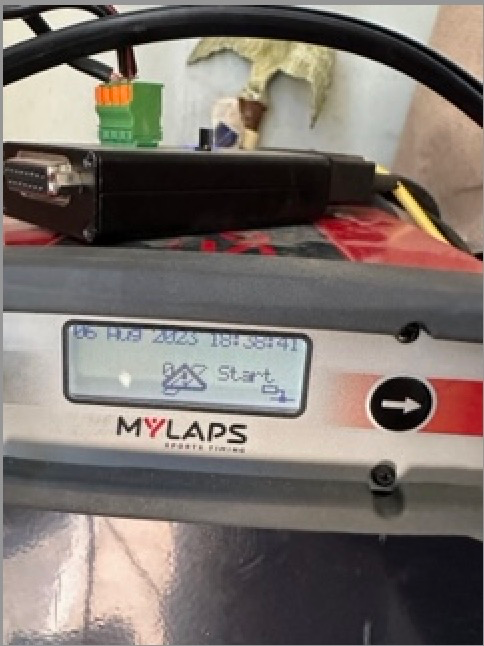

{: style="width:500px"}

| Symptom | Solution |
| ------ | -------- |
| Decoder is too hot and will stop working | Cool down decoder |
| Timeline setting is incorrect | Go to MENU Click Timeline, then Loop trigger and set that to OFF. |

