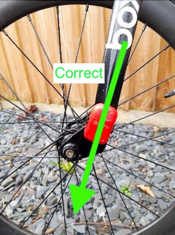
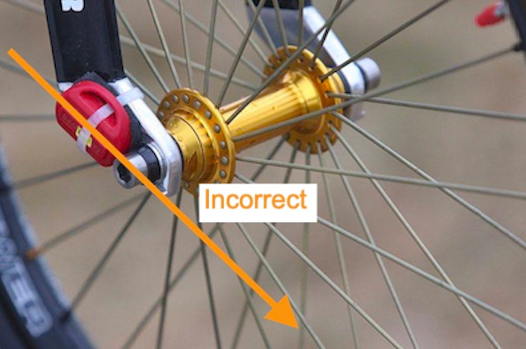

## Transponder position guidelines

The position of the transponder on the bike can have an effect on the 
times as the rider goes across the timing loops. Transponders should be fitted:

- On the front forks 
- As far down the fork leg as possible but not on the drop out
- outside or inside the forks is OK
- left or right fork is OK however, some organisations may have a preference

!!!NOTE 
    Transponders should not be fitted to the drop-outs at the bottom of the forks. 

    There is an antenna that runs up and down the transponder, this needs to 
    point directly to the ground under the fork. If a transponder is attached 
    to the drop out then the signal will be picked up early.

## Correct Position

Transponder is in line with the forks and the signal will be picked up correctly.

## Incorrect position

The transponder is in line with the drop out and the signal will be picked up too early.

!!!Handy tip 

    Put a piece of inner tube onto the fork and put the transponder into the inner tube (see image below).

    **NOTE**: The transponder can be placed inside or outside the fork.

