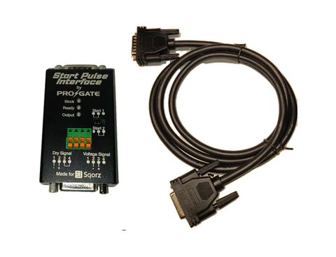

## Computers

Any Windows computer is suitable if you are running the Sqorz software.

Recommended spec is as follows:

- Intel i5 processor or equivalent
- 8GB RAM

To ensure the computer is reliable regularly connect the computer to the internet to update Windows.

The following software is used: Sqorz

Sqorz can be downloaded from here: [www.app.sqorz.com/downloads](https://www.app.sqorz.com/downloads)

## Printer

Laser printers are preferred over Ink jet printers as they are generally faster, cheaper to run 
and more reliable.  Colour printing is not required.
Therefore a mono laser printer is recommended.
Options of network and wireless connectivity are handy but not compulsory.
Make sure you have a spare cartridge on hand. 

The following printer has been found to work well - **Brother HL-L5200DW** 

It prints 40ppm and is extremely reliable.

Toner cartridges are available for this printer that print 8,000 pages, this is by
far the most economical way to do this.

## UPS
 An UPS (Uninterruptible Power Supply) is good to have as a backup as if the 
 power fails to the Finish Decoder while a race is on the track you will not be 
 able to score the race.  Plus the UPS provides protection to the equipment from power spikes.

## Networking your System

At the very least you will have the following on your network:
- 1 or more laptops
- Decoder
- Printer

You will either need a router or a switch to connect all the equipment.
If you use a switch you'll need to assign IP addresses manually to your equipment which
will need a basic level of technical knowledge to do.

It is recommended all equipment is connected by LAN cables as opposed to using wireless.

## Decoders
Decoders take the transponder signal from the loops and assign a time to them.
They then send the transponder number and the time to the MyLaps Timing & Scoring software.

It is possible to run a race with both the start and hill loops going into 1 decoder however,
it s preferable for each loop to have its own decoder.

<figure markdown="span">
{: style="width:500px"}
  <figcaption>MyLaps Decoder</figcaption>
</figure>

## Transponders

<figure markdown="span">
{: style="width:500px"}
  <figcaption>The ProChip Flex type are sold on a subscription basis for 1, 3 or 5 years</figcaption>
</figure>

## Start Pulse Interface Box

An interface box is required between the Start Controller and the Decoder.

The start pulse interface box provides three functions:

- Interfaces between the Start Controller to the 5v input of the MyLaps Decoder.
- Allows connection of the GPS as well as the start signal to the same input on the decoder.
- After a start signal is received the box blocks any further spurious start signals from 
      being received by the Decoder for 5 seconds.

If a ProGate Controller is used then a second interface box is required due to the connector type used on the ProGate.

Marty Baker produces these interface boxes. For more information please contact him 
directly at Martyb@bigpond.com or 0418875760.

## GPS Unit

If more than 1 decoder is used then each Decoder requires a GPS unit to be connected to 
synchronise the times of the decoders.

i.e 2 decoders will required 2 GPS units.

{: style="width:500px"}