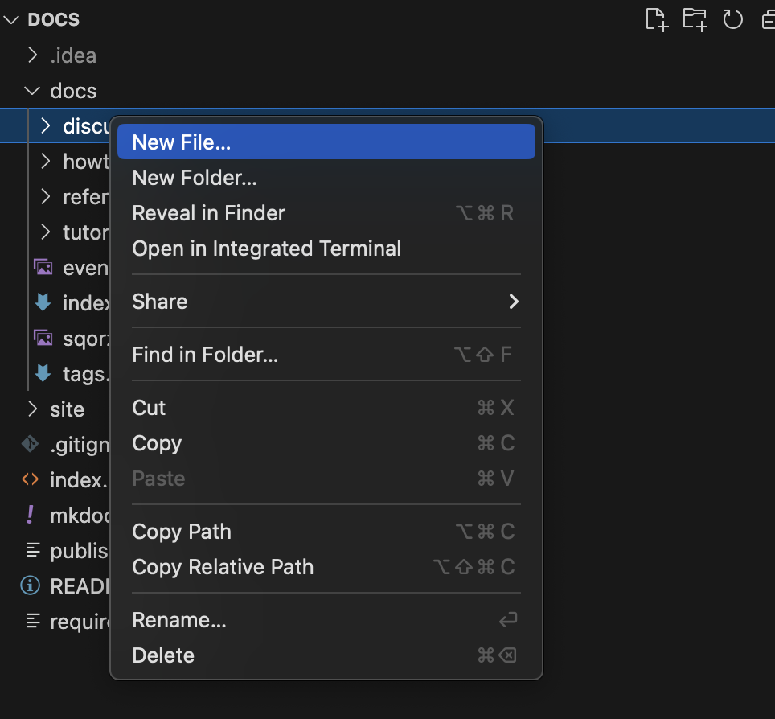
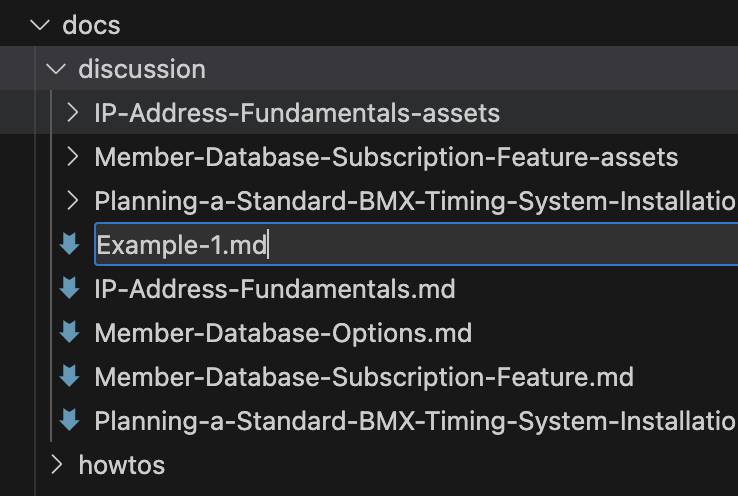
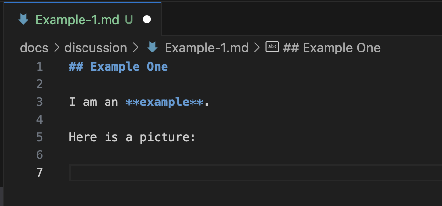
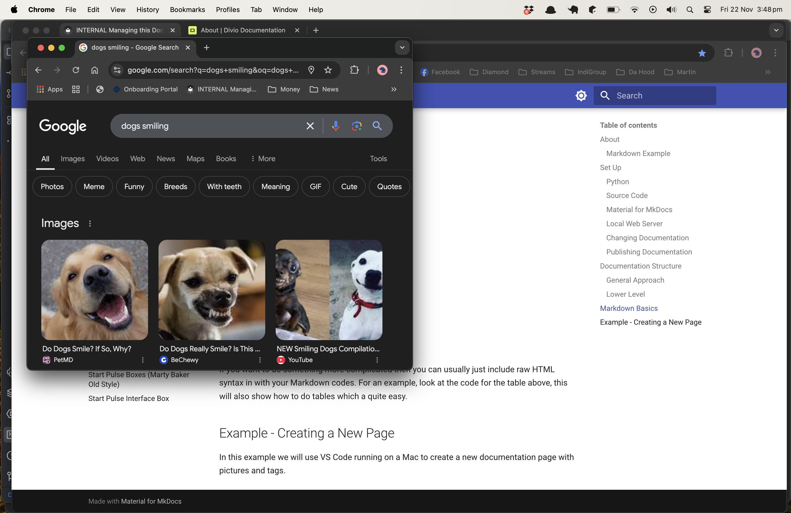
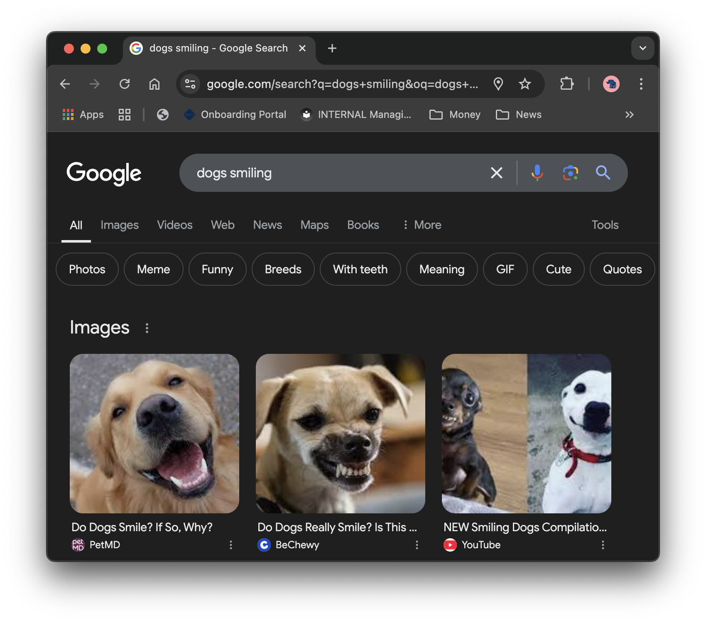
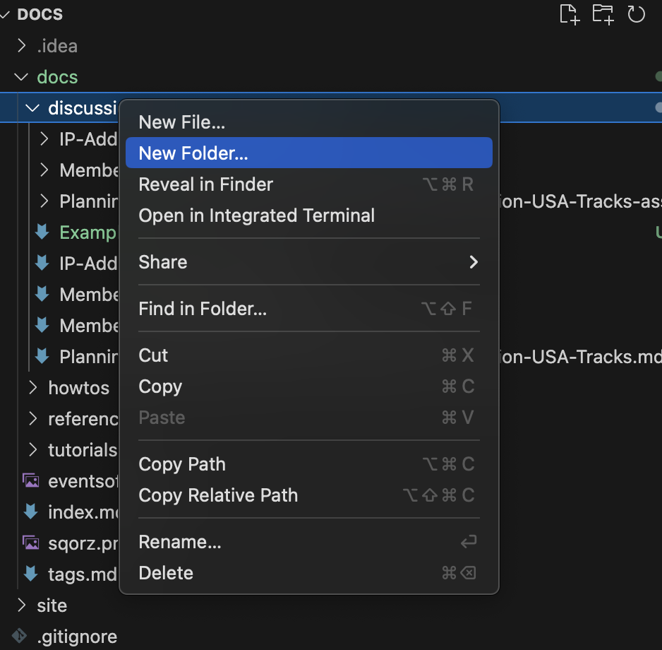
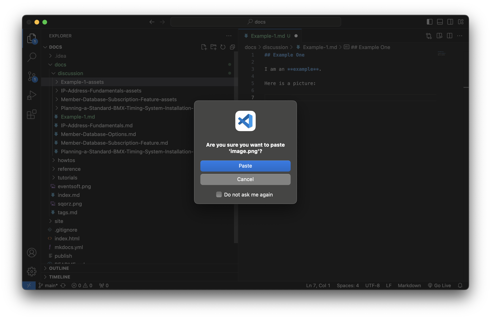
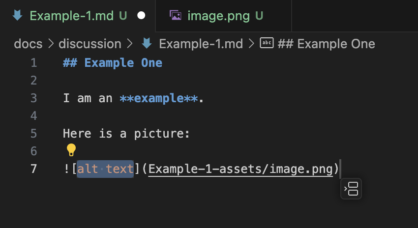
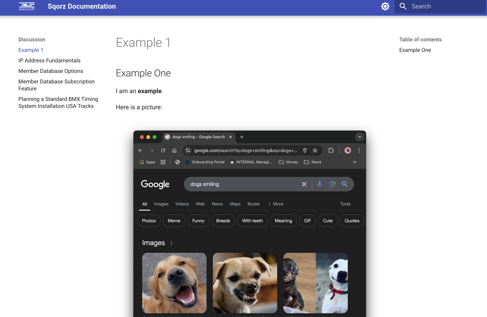

!!!Move this out of the documentation

    This file is not included in the index.

## About

The documentation for the Sqorz system is maintained in [Markdown](https://en.wikipedia.org/wiki/Markdown). 
Markdown is a very simple language
that can be used to generate nice looking HTML for use as a static website for documentation.

HTML is very powerful but can be fiddly to write. Using Markdown achieves the same output but allows
you to focus on the content rather than the presentation.

### Markdown Example

=== "Markdown"

    ```markdown
    
    ## Big News!
    
    - Easy to write
    - Easy to maintain
    
    
    
    ```

=== "HTML"

    ```html
    
        <div class="tabbed-block">
        <h2 id="big-news">Big News!</h2>
        <ul>
        <li>Easy to write</li>
        <li>Easy to maintain</li>
        </ul>
        <p><a class="glightbox" href="../../sqorz.png" data-type="image" data-width="auto" data-height="auto" data-desc-position="bottom"></a></p>
        </div>
    
    ```

=== "Appearance"

    \## Big News!
    
    - Easy to write
      - Easy to maintain
    
    

There are lots of references for Markdown(e.g. 
[https://www.markdownguide.org/cheat-sheet/](https://www.markdownguide.org/cheat-sheet/), 
but we will also cover the basics that you need further down on
this page.

As well as Markdown we use [Material for MkDocs](https://squidfunk.github.io/mkdocs-material/). This 
is a Python wrapper for Markdown and gives us
some nice styles and some useful add-ons such as support for tags.

## Set Up

In order to make changes to the documentation, you first need to set a few things up.

### Python

If you don't already have Python installed on your computer then you can install it 
from [https://www.python.org/downloads/](https://www.python.org/downloads/). Some things don't work well on earlier
versions of Python. Python 3.12 was used to build this.

It is recommended, but not essential, that you use a virtual environment which separates the Python packages
needed for the Sqorz documentation from any other Python activity on your computer.

Open a command prompt (Terminal on a Mac or cmd on Windows).

Check that Python is installed.

```commandline

python -V
Python 3.12.3

```

Now create a new directory for your work:

```commandline

mkdir sqorz-docs
cd sqorz-docs

```

If you want to use a virtual environment, then also run:

=== "Mac"

    ```commandline
    
    python -m venv myenv
    . ./myenv/bin/activate
    
    ```

=== "Windows"

    ```commandline
    
    python -m venv myenv
    . .\myenv\bin\activate
    
    ```

### Source Code

!!!Initial Set Up Only
    This step is only required the first time the documentation is moved.

    If you are setting this up subsequently, then get the files from wherever they
    are stored, the version on GitHib will be out of date.

The initial documentation lives in Github. You can access it 
at [https://github.com/mgu3/sqorz-docs](https://github.com/mgu3/sqorz-docs).

```commandline
mkdir docs
cd docs
git init
git remote add origin https://github.com/mgu3/sqorz-docs
git pull origin main

```

You don't need to use git, so you can now remove its files that handle versioning etc.

```commandline
rm -rf .git
```

### Material for MkDocs

We use some Python packages which are listed in the file `requirements.txt`. You don't need
to add these manually, you can use `pip` to install all of them at one by telling it the
name of the file.

```commandline

pip install -r requirements.txt

```

### Local Web Server

You can start a local web server to help you while editing the documentation:

```commandline

mkdocs serve

```

Now you can open a browser to view your documentation at [http://127.0.0.1:8000/](http://127.0.0.1:8000/)

### Changing Documentation

The documentation is in text files so you can use any text editor to make changes. The changes will immediately
be updated by the local web server (including any pages you already have open).

The examples here assume you are using VS Code, but you can use anything you prefer.

### Publishing Documentation

!!!NOTE

    **To Be Completed**

    Damian will find a suitable location for the documentation and provide
    instructions on how to publish it.

    The `site` directory is the part that needs to be published. Prior to 
    publishing it, you need to run `mkdocs build` to update this directory.


## Documentation Structure

### General Approach

We use the [Diataxis](https://docs.divio.com/documentation-system/) 
approach of classifying documents into four categories:

- Tutorials
- How Tos
- Discussion
- Reference

You will find the document structure has these as directory names.

### Lower Level

Each page consists of a single file in Markdown format which has the extension `.md`.

Many pages also have images. These can be found in a directory in the same location
as the Markdown file with the same name but with `-assets` on the end.

## Markdown Basics

Markdown is pretty easy, if you want to do anything complicated you can Google it.

| Format          | Markdown                                               |
|-----------------|--------------------------------------------------------|
| Heading         | `# H1`<br>`## H2`<br>`### H3`                          |
| Bold	           | `**bold text**`                                        |
| Italic	         | `*italicized text*`                                    |
| Blockquote	     | `> blockquote`                                         |
| Ordered List	   | `1. First item`<br>`2. Second item`<br>`3. Third item` |
| Unordered List	 | `- First item`<br> `- Second item`<br> `- Third item`  |
|Code	| \``code`\`                                              |
|Link	| `[title](https://www.example.com)`                     |
|Image	| ``                               |

If you want to do something more complicated then you can usually just include raw HTML
syntax in with your Markdown codes. For an example, look at the code for the table above,
this will also show how to do tables which a quite easy.

## Example - Creating a New Page

In this example we will use VS Code running on a Mac to create a new documentation
page with pictures and tags.

Start by creating a new file. In VS Code Ctrl-Click on the discussions directory and select **New File...**:

{: style="width:500px"}

Lets call it Example-1.md

{: style="width:500px"}

Enter some text into the file:

{: style="width:500px"}

Now we will capture an image to put into our document. On a Mac you can capture screenshots
using Shift-Cmd and numbers. Here is the whole screen and we want to capture the dog pictures:



Press Shift-Cmd-4 and then put the mouse over the dogs and press space. Now click on the dogs to
capture the screen. This will save it to the desktop. You can copy the file into VS Code.

If you look on your desktp you will see this file:

{: style="width:500px"}

Create a new directory in VS Code and call it Example-1-assets and copy the file into it.

{: style="width:500px"}


Now you can click on the file in VS Code and copy it and paste it into your document (or type it 
all in if you prefer)

{: style="width:500px"}

Now you need to add it to the index.md file. Add it anywhere, for example at the bottom of this section:

```markdown

???+ quote "Discussion"
    
    * [Member Database Subscription Feature](discussion/Member-Database-Subscription-Feature.md)
    * [Member Database Options](discussion/Member-Database-Options.md)
    * [Planning a Standard BMX Timing System Installation USA Tracks](discussion/Planning-a-Standard-BMX-Timing-System-Installation-USA-Tracks.md)
    * [IP Address Fundamental](discussion/IP-Address-Fundamentals.md)
    * [Example 1](discussion/Example-1.md)
```

Now you can see your new file:

