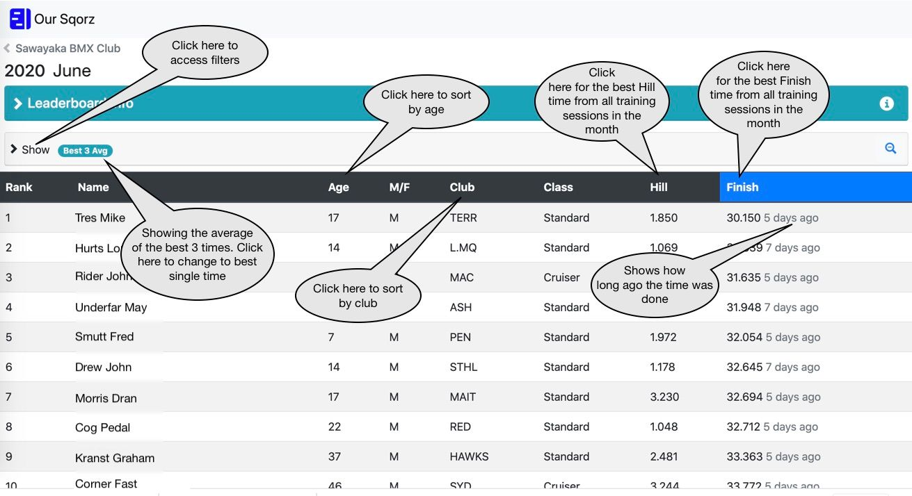
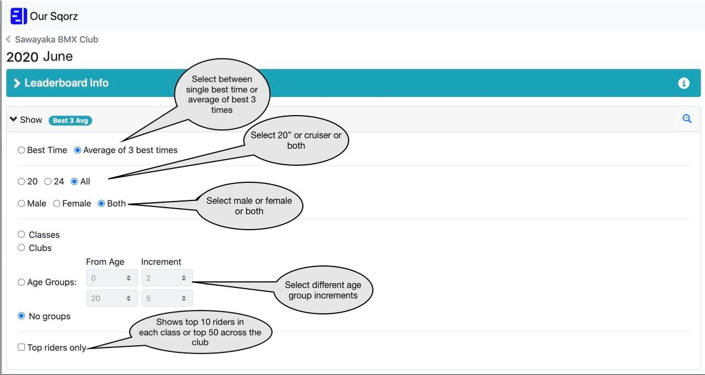

!!!Info
    The Sqorz Leaderboard shows the best times for riders across all the timing loops in 
    the track. These can then be sorted and filtered in any different way to see 
    how riders times compare to each other. 

!!!Info
    The monthly leaderboard collects time for the month allowing clubs and 
    tracks to create competitions based on data such as full lap times, hill times.
    
    The annual leaderboard board does the same but across the whole year 
    allowing riders to continually work on their times.

!!!Info
    The Sqorz Leaderboard provides the opportunity for riders to race 
    against each other without the need for them all to be at the track at the same time.

