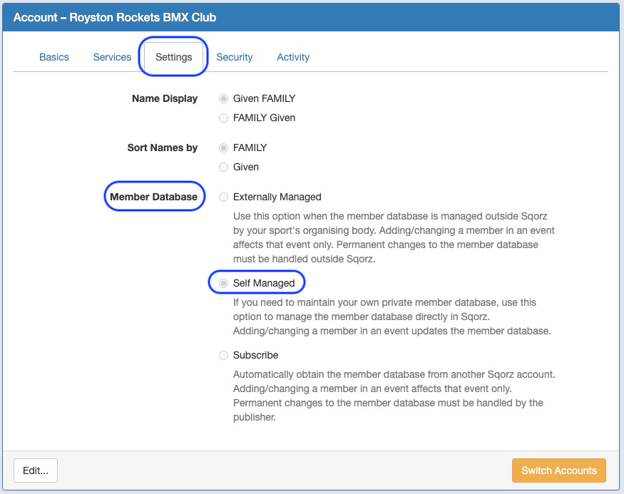
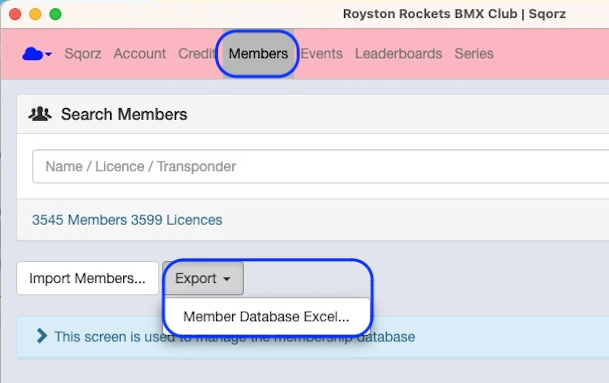
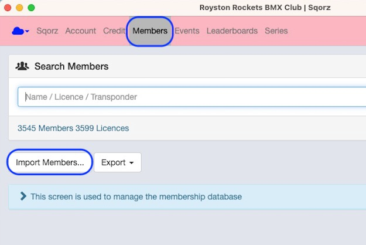
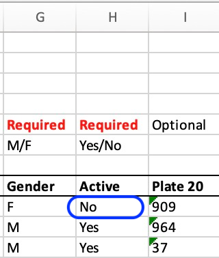

## Attributes

- The Self Managed member database has the following attributes
- Allows clubs / organisations to manage their own database
- Changes that are made to riders at event level will populate the member database when the event has been saved back to the cloud
- New riders that are added to an event will also be appended to the member database when the event is closed
- It is possible to make bulk amendments to the Self Managed database by exporting the data and reimporting.

## Export the database
Click on Export > Member Database Excel

## Make changes to the database

- Save the Excel file somewhere.
- Make the necessary changes
- Reimport the file 

## Import the database

## Changing rider details 

Riders are identified by their licence number. So, you can change any rider 
details except for the licence number. 

If you want to change the licence number then you will need to create a 
new profile for the rider and de-activate the old profile in the Excel 
file by putting ‘No’ in column H

