## Timing Positions

In general the Transponder system uses 3 timing positions around the 
track for racing and 4 or more for training.

* Gate drop.
* Bottom of the Start Hill or 30' (whatever suits)
* Intermediate loops (at the very least a loop at the entry to the first corner is highly recommended)
* Finish line.

The **Gate Drop** is picked up with a cable run from the Start Controller to the 
Decoder running to a start pulse box.  See further in this document for details.

The **First loop** is put at the bottom of the Start hill.  Normally about 
10m (30') from the gate, this measurement is not critical and basically goes wherever suits. 

The **Corner 1 Entry loop** is placed at the entry to corner 1, the main thing here is that 
it is parallel with the first loop.

The **Finish loop** is also two parallel conduits run across the track. 
The finish is when the transponder is exactly in the middle of the loop.  
With the transponder mounted on the fork this puts the front wheel just touching the finish. 

Extra timing loops can be added at various positions around the track.  
These loops give split times around the track when used with the Sqorz training software.  
Uses for these intermediate loops are for coaching sessions and for commentary to assist 
the announcers identify the riders and positions.

## Decoder Cabling

The Decoders are normally in the scoring/registration office.
Cables are required from the decoders to the timing positions.
The cables from the loops are coax type cables (RG6 or RG59).
MYLAPS coax is recommended for 2 reasons:

* It connects directly to the loop without a BNC connector 
     (bad BNC connections can be a source of timing issues)
* Using MyLaps coax means you will have MyLaps equipment from the loop all the way to the decoders

<figure markdown="span">
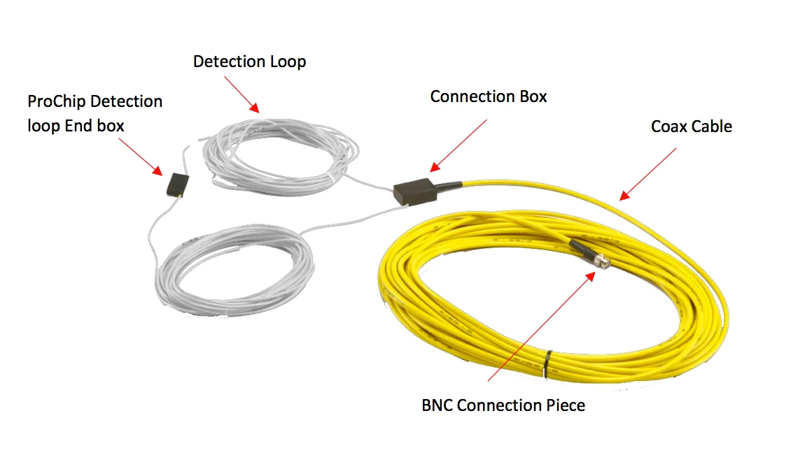{: style="width:500px"}
  <figcaption>MyLaps Loop and Coax</figcaption>
</figure>

## Start Pulse Cable
The start pulse cable is run from the Hill Decoder to the start controller.
Any 2 wire insulated cable can be used. It can be buried or overhead cabled,
it should be in conduit to protect it. If the Start Hill has a roof 
it can be run along the roof to reach the start controller.
No connectors are required on this cable.
This cable connects directly to the Start pulse box.

### Cables from Mylaps

Track cabling supplied from Mylaps comes in the following sizes:

#### Detection loops

- ProChip detection loop 6m
- ProChip detection loop 9m
- ProChip detection loop 12m
- ProChip detection loop 16m

- Optimum loop size is the width of your track + 2m (loops can be cut to 
- size so always get something bigger than you need).

#### Coax

- 5m and connector box
- 20m and connector box
- 50m and connector box
- 100m and connector box

### How to Install Track Cabling

Below is photos of how to physically install the conduits and cabling at the track.

MYLAPS advises loops running though conduits should be 100mm deep but they can be shallower.
Basically have them deep enough that they are not going to be impacted when doing track maintenance.
If you have a concrete start hill then run two cuts in the concrete across the track 600mm (20') 
apart. Lay the cable into the cuts and hold it in place with some silicone/caulking.

#### Timing Loops
The size of that conduit will determine what elbows, t-pieces and inspection 
points you use. The following pictures have all been made out of 
25mm (1") pipe, which is enough for the loop.

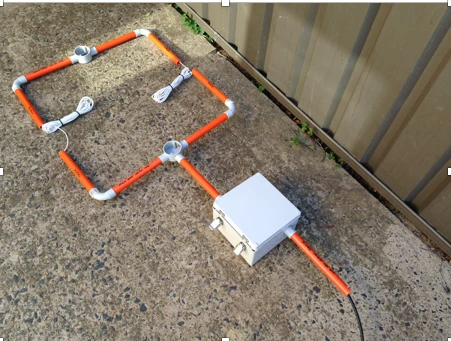{: style="width:500px"}

### Position of the Elbows and Pipes in the Track

The elbows (ends of the loop) need to be 50cm past the white line on the track. 
Therefore, you need to know where the sides of your track are, 
and where they will always be. This may require measurement from a 
fixed point at the venue so you can always tell where the ends of the loops are.

This also means you need to know “exactly” where the finish line is,
and where it will always be. So measurements from the jumps on the
track for instance are not accurate, and will change over time.
So you need to measure from something at your venue that will not move
(like a drain grate, or power pole etc). You will need exact drawings
because the white finish line needs to be in a very specific place and
over time this buried system will be forgotten.

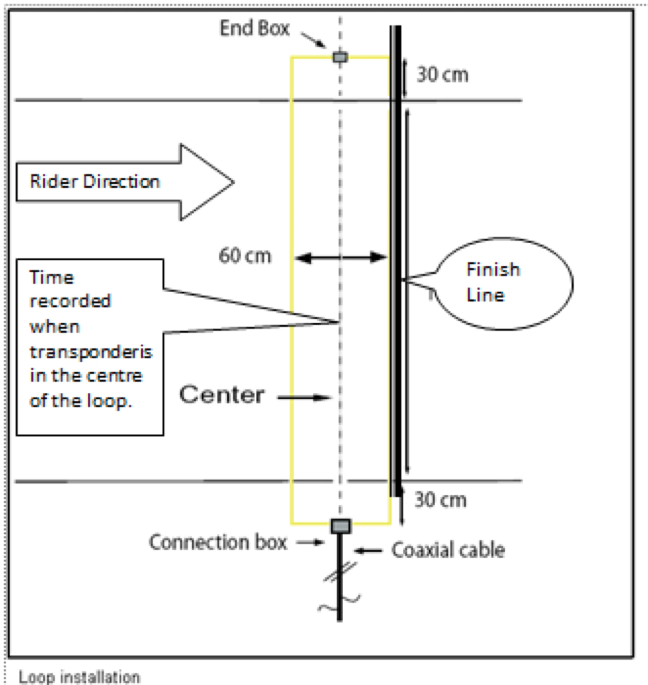{: style="width:500px"}

### Finish line position

The white line marked on the track goes on the last pipe in the ground.
So when travelling down the finish straight, you will pass over the first
pipe in the ground, then 60cm later you will pass over the second or last
pipe in the ground. The white line must go directly over the last pipe.

For this reason you need to put something in the ground beside the track
to mark the finish line, or have a way of measuring exactly where that
pipe is as you will need to remark it both during a race day and once
or twice a year when using the finish line.

It is also very important to know where the sides of the loops are,
so that you can paint your white lines in the right place each time.
The track may change from year to year and move away from the
correct positioning of the pipes.

### Start Straight loop position

This doesn’t matter. The start straight loop can be 
anywhere near the bottom of the start hill.
There is no specific measurement for this.
It’s a good idea to keep track of the exact distance just so you
know where it is when digging your track at a future date.
You will also need to know where the sides are.
Over time tracks get wider or narrower based on dirt work by different people,
and without marking on the start hill, or some measurement, you may well
end up with the track running outside your loops in the future.

<figure markdown="span">
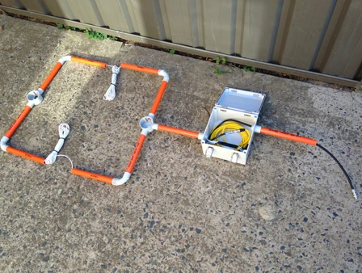{: style="width:500px"}
  <figcaption>Overall View with the Box Open</figcaption>
</figure>

<figure markdown="span">
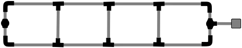{: style="width:500px"}
  <figcaption>Option with Bracing to Ensure Uniform Spacing</figcaption>
</figure>

!!!Note
     It is almost impossible to stop water getting into the box, the way to
     manage this is to drill some holes in the bottom of the box and ensure
     it sits on good drainage so the water can find a way to escape.

!!!Warning
     Do not run any cabling in, near or across the loop areas or that
     cable will become an antenna or extension of the loop and will produce spurious signals.

!!!Note
     * It is preferable to run loops across the track in conduit however, they can be laid 
     * directly in the dirt if necessary
     * Timing loops can be cut into concrete but do not go to deep, about 12mm (1/2") is about max depth
     * Timing loops will not work under concrete
     * Do not run any other cables or wiring near the timing loops
     * The diameter of the conduit for the timing loop should not be any greater than 25mm (1") and preferably less
     * You will need a pit in the ground at the side of the track bay the loops
     * You will need to permanently mark the location of the loops especially the finish as the finish line can move over time
     * The timing loop and coax have push connectors, we recommend cutting these, soldering the wires together and making the joint waterproof
     * The diameter of the conduit for the coax needs to be big enough to accept extra cables, you may decide to run the following in the future:
          - more coax for exra timing loop locations
          - speaker wires
          - web cams
     * Coax can be shortened and a new BNC connection plug attached however, you should have a professional do this — connections are always the weakest point

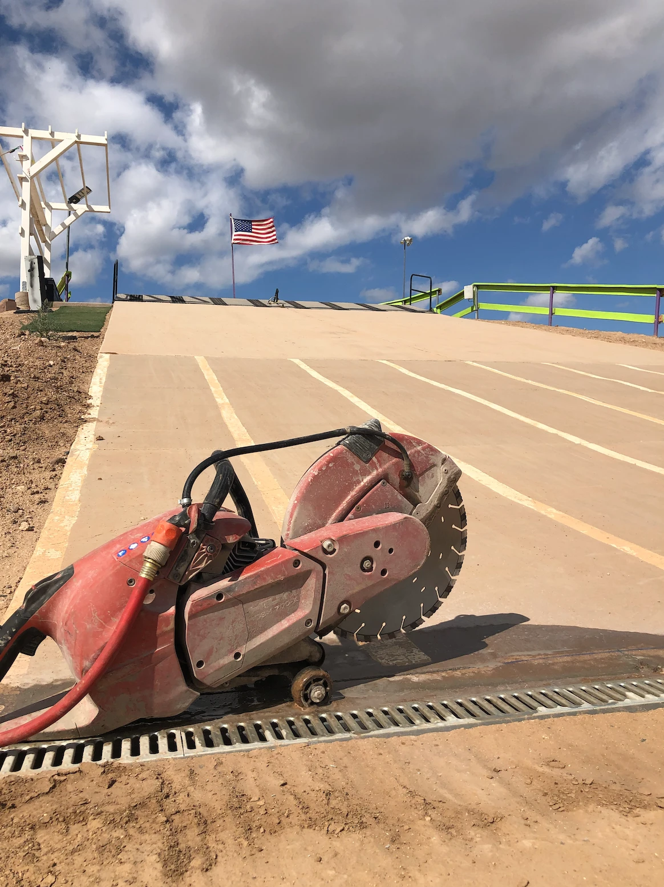{: style="width:500px"}
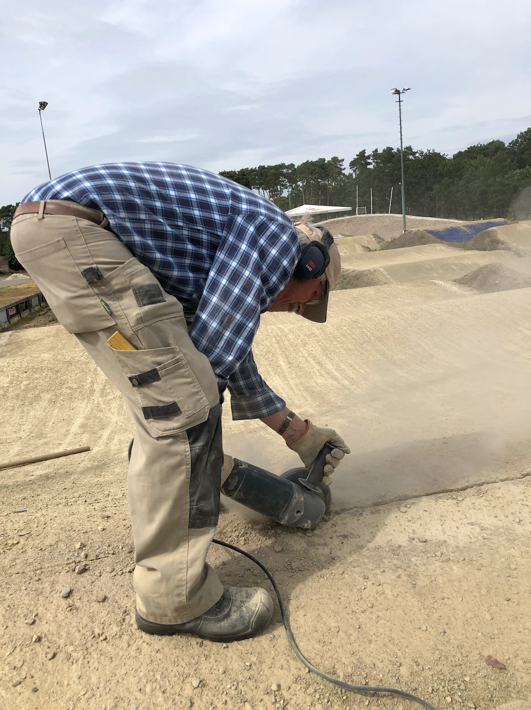{: style="width:500px"}
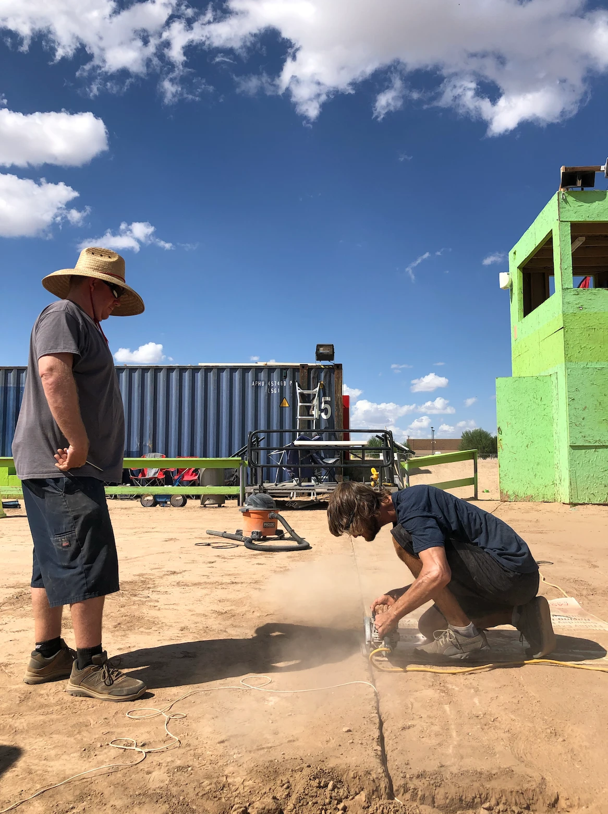{: style="width:500px"}
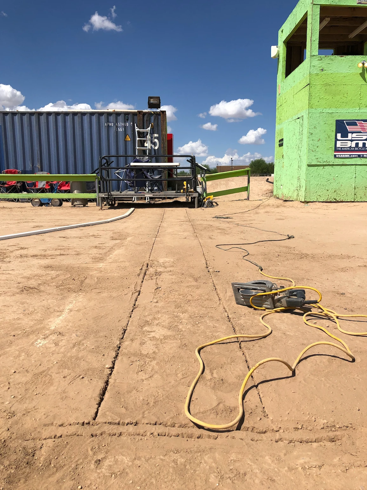{: style="width:500px"}
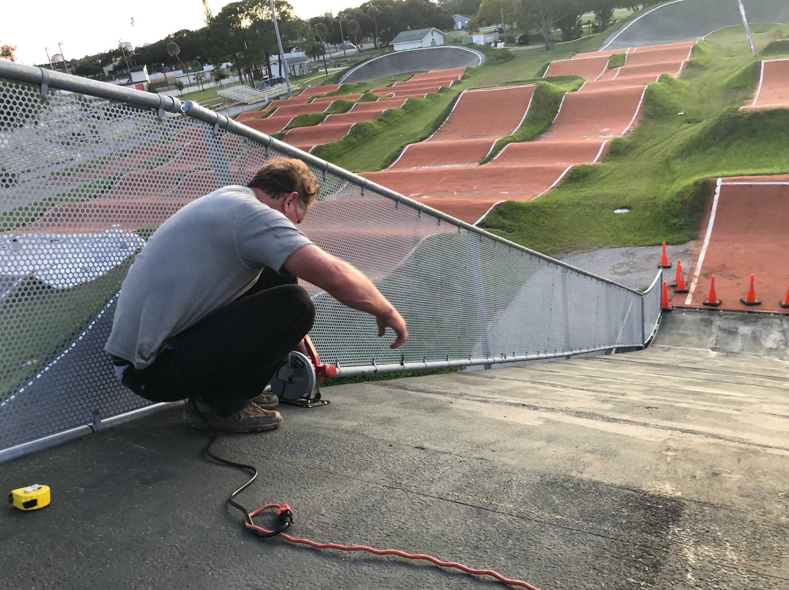{: style="width:500px"}
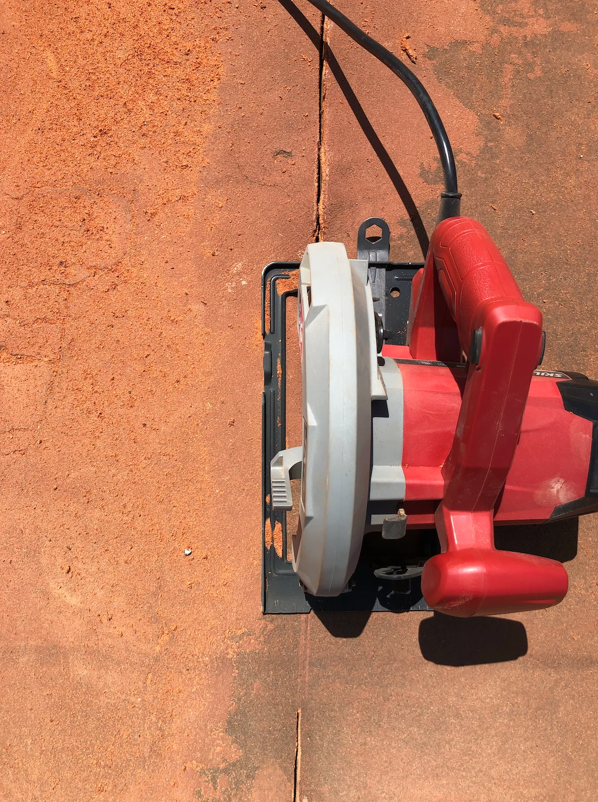{: style="width:500px"}
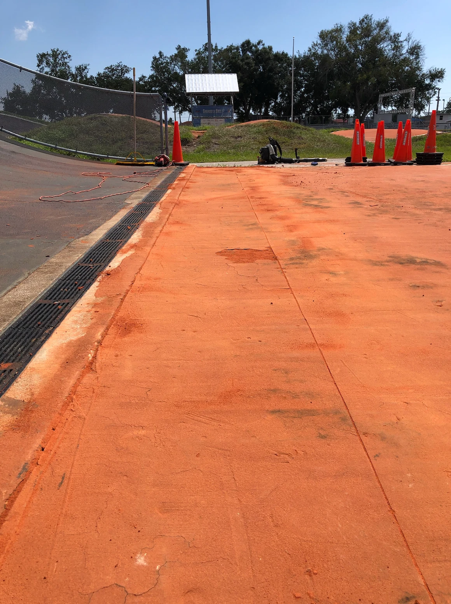{: style="width:500px"}
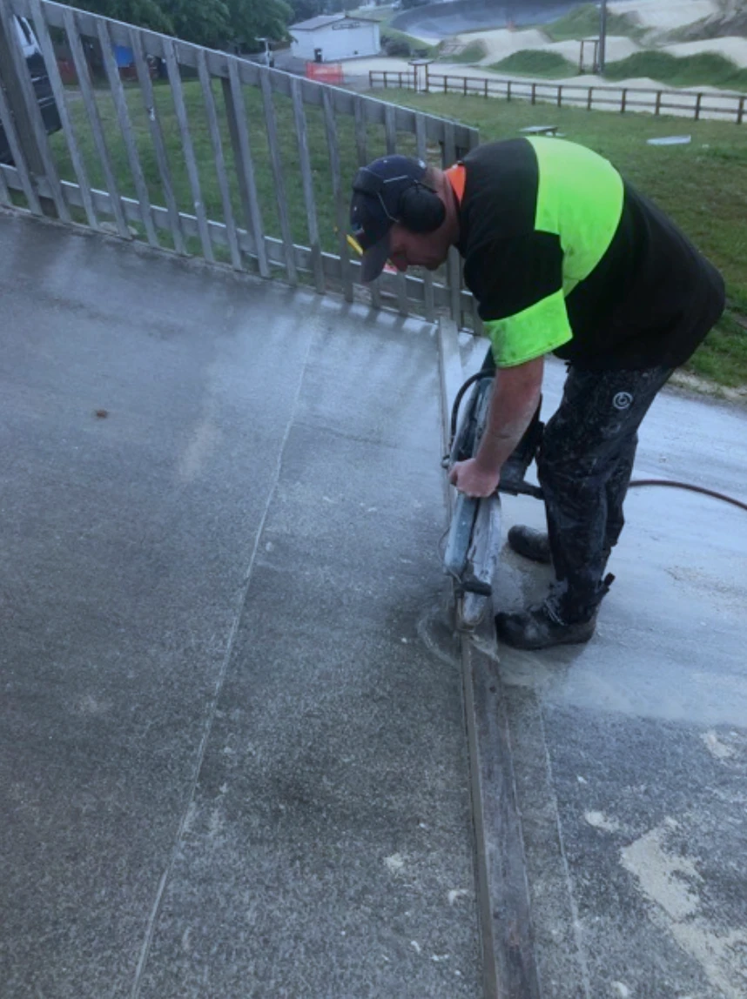{: style="width:500px"}
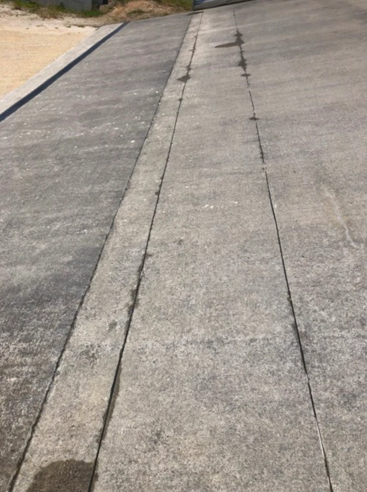{: style="width:500px"}
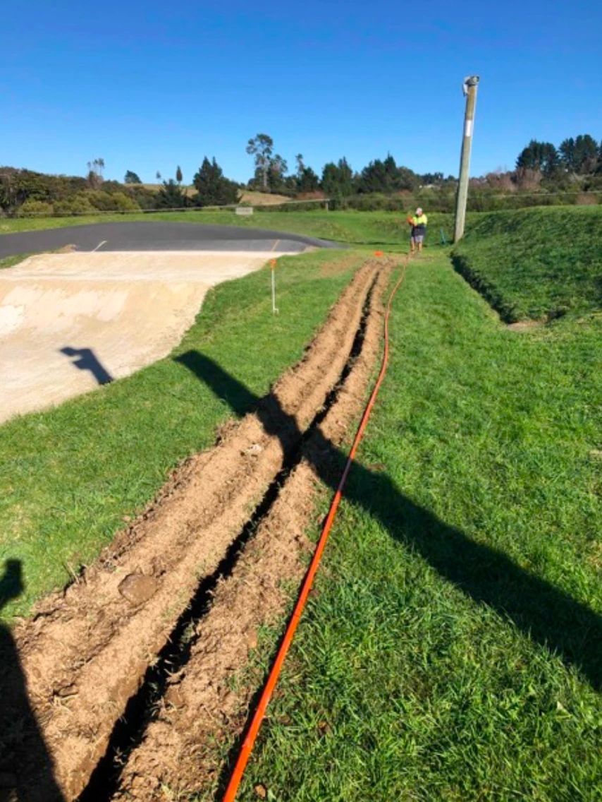{: style="width:500px"}
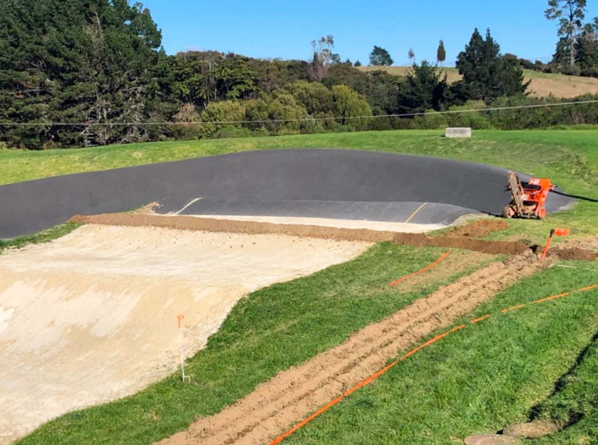{: style="width:500px"}