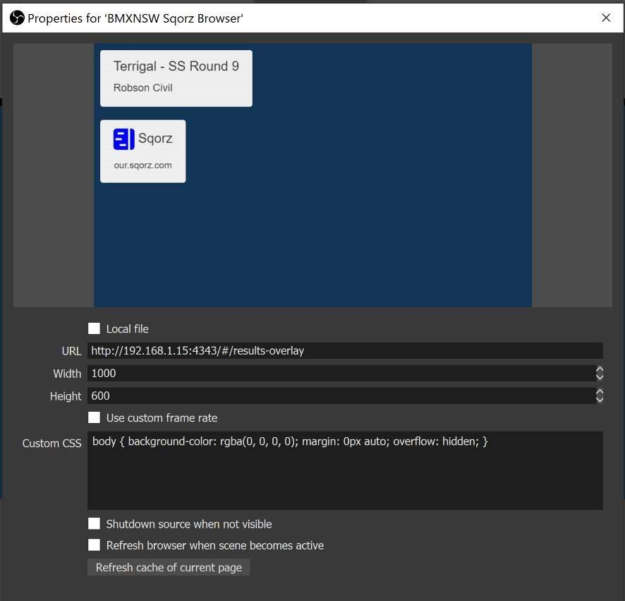

---
tags:
  - 3rd Party
  - Hardware
  - Live
---
## What You Will Learn

Once you complete this tutorial you will be able to live stream an event on Facebook.

## Pre-requisites

In order to complete this, you will need:

- Laptop Running OBS Studio.
- Video Capture Card(s)
- Strong Wi-Fi Connection to Sqorz Network and Sqorz 4G Internet
- Web Access to Sqorz Results Feed.
- Strong 4G Signal

## Facebook Setup 

Facebook - click on Live (see below)  

Next click on Connect and copy the Persistent Stream Key (see below)  

Above – You can not press GoLive until Facebook detects the stream has started. 
The next part of the guide details how to start streaming with OBS Studio to facebook.  

## OBS Studio Setup 

Click on Settings button at the bottom right. 

Click on Stream and set the Service to Facebook Live. Insert the Facebook Stream Key here.  

Scenes are where you define different cameras and or info splash screens.  

Sources are linked to the scene and how we define what is shown in the video feed. 

Right click to Add Sources to the scene such as;   

- Image – Event Logo.  
- Video Capture Device – Video Stream
- Browser – Sqorz Results. 

To display the Sqorz Results over the video we will be displaying a web page over the video. 

In a web browser find and open the Sqorz local web services to find the correct IP address. 

             Eg. http://192.168.1.15:4343  

The results overall add ‘/#/results-overlay’ to the address 

            Eg. http://192.168.1.15:4343/#/results-overlay  

Right click in Sources and add a Browser.

Insert the Sqorz web address and set size to 1000 x 600 like below. 
Note the page might take ~1 minute to load. 

We now want to make the background colour transparent.  

To set transparency right-click on the Browser source and select Filters, and add a Chroma Key. 

Change the Key Color Type from Green to Custom. 

Select the Key Color to be  HTML: #123456. This will make the blue background transparent.

The background should now be transparent (see below)  

We are now ready to start streaming (where the screen above is black should be the camera feed).  

Press Start Streaming in OBS Studio and then return to Facebook and press Go Live. 

## Additional Information

Here is a great tutorial on optimising OBS settings for Facebook 

[https://www.youtube.com/watch?v=yTt5IxFWaEM](https://www.youtube.com/watch?v=yTt5IxFWaEM)

