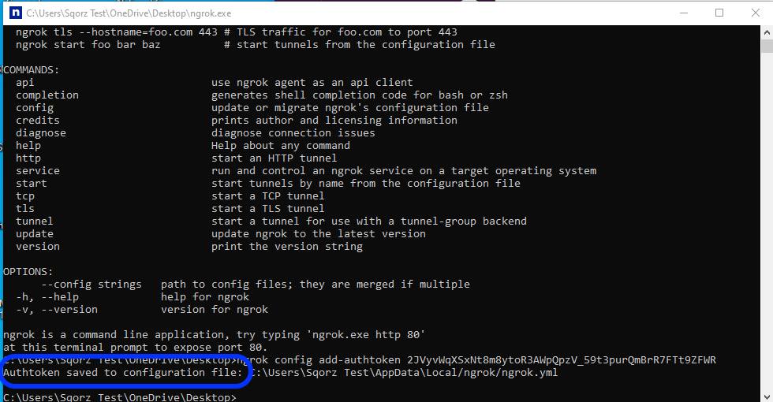

---
tags:
  - 3rd Party
---
## What You Will Learn

Once you complete this tutorial you will be able to publish results on the Internet.

## Pre-requisites

You need to have completed the [Setting Up Your Club](Setting-Up-Your-Club.md) tutorial.

## Purpose

Sqorz Local Web Services distributes live results to other computers/tablets via the 
local network at the venue. However, this service does not distribute live results via the Internet.

[NGROK](https://ngrok.com/) is a third party utility that can be used for publishing live 
Sqorz Web Service results via the Internet. There are free and paid plans, the 
free plan is generally good enough for the distribution of Sqorz Web Services.

!!!Important Notes

    NGROK is not supported by Eventsoft Pty. Ltd. Any queries pease refer to the NGROK 
    website for more detailed instructions [ngrok | API Gateway, IoT Device Gateway, 
    Secure Tunnels for Containers, Apps & APIs](https://ngrok.com/) 
    
    Each active NGROK connection puts load onto the Sqorz computer, it is 
    highly recommended that  connections using NGROK are kept to a minimum 
    to avoid impacting the operation of Sqorz

## NGROK — initial setup (Windows)

- Download NGROK: from here Download ngrok
- Place the file in a directory or on your desktop
- Double-click the file to unzip NGROK
- You need to sign-up to NGROK to obtain a Token Number. Sign-up to NGROK here: ngrok - Online in One Line
- You will receive a mail from NGROK

Click on “Get your Auth Token here” 

- Go to “2. Connect your account” and copy all the text
- Go back to NGROK on your computer and double click the NGROK icon — a black screen will appear
- Copy and paste the text you copied
- Press Enter

You will see the text “Auth token saved to configuration file”
Done. Close the black screen.

## NGROK — how to use

### A. Set up an event in Sqorz

Open the event

Go to Settings > Services and enable Local Web Services

For Training make sure the Training checkbox is Enabled (see image below)

### B. Set up NGROK

Double-click the NGROK icon — a black screen will appear

Enter or copy/paste the following text — ngrok http 4343

Press Enter

Copy the text on the line that says “Forwarding” e.g. https://xxxx-xx-xx-xxx-xx.xx.ngrok.io

Paste this text into the url address bar in a browser on a device with Internet access (computer, tablet)

The Web Services menu will appear

Select the required service from the menu