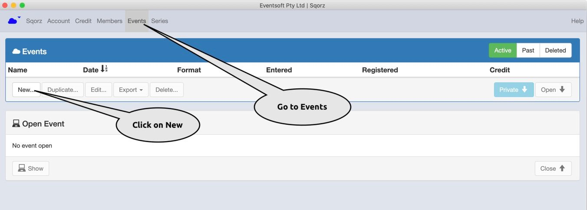
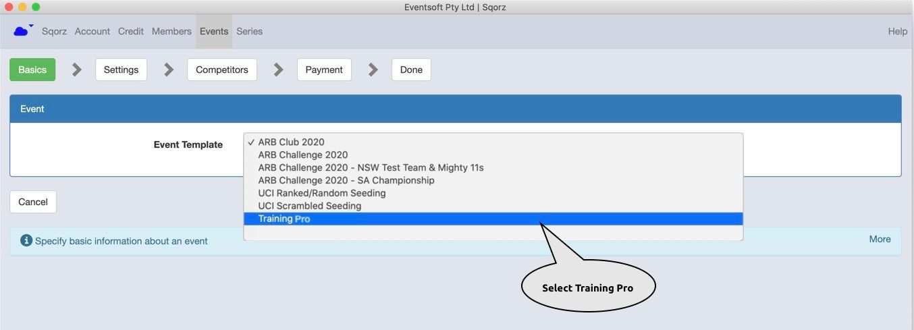
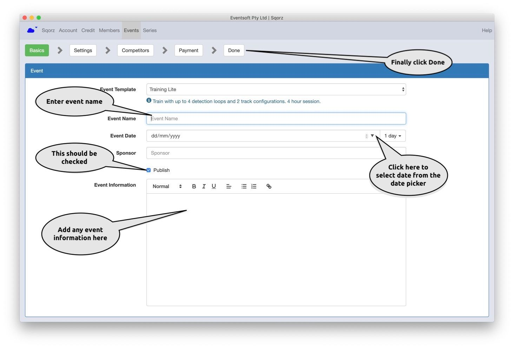
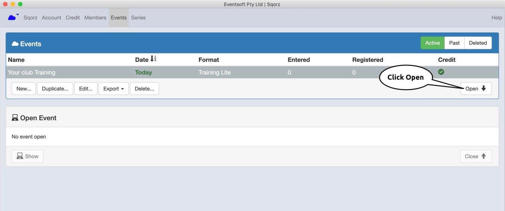
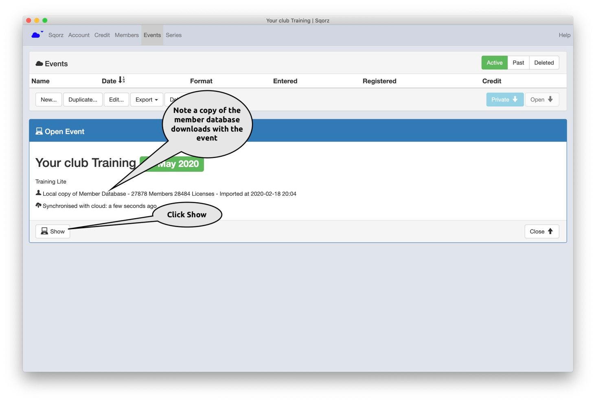
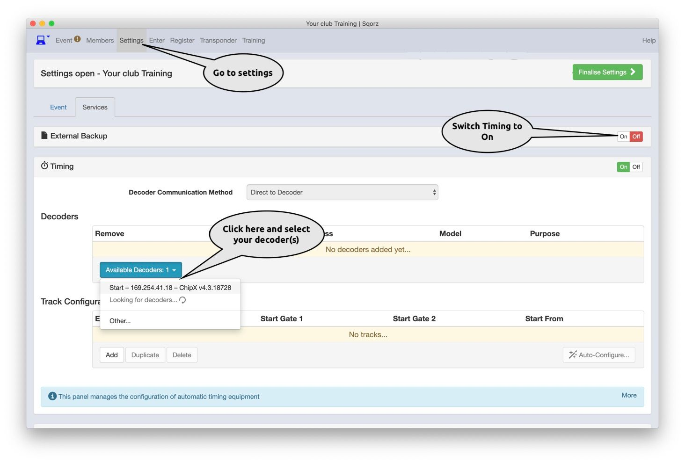
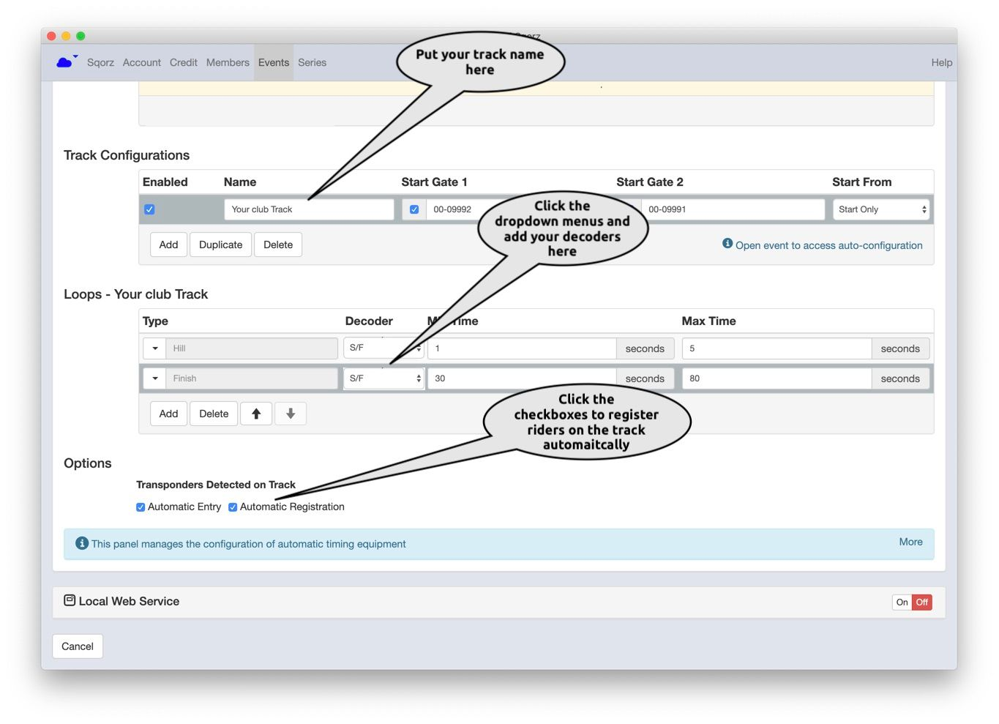
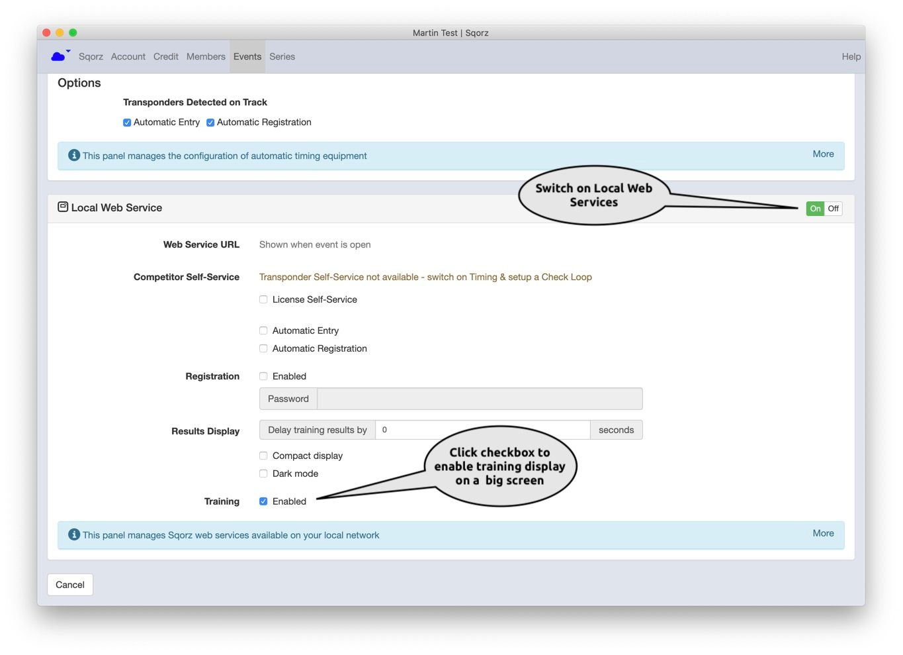
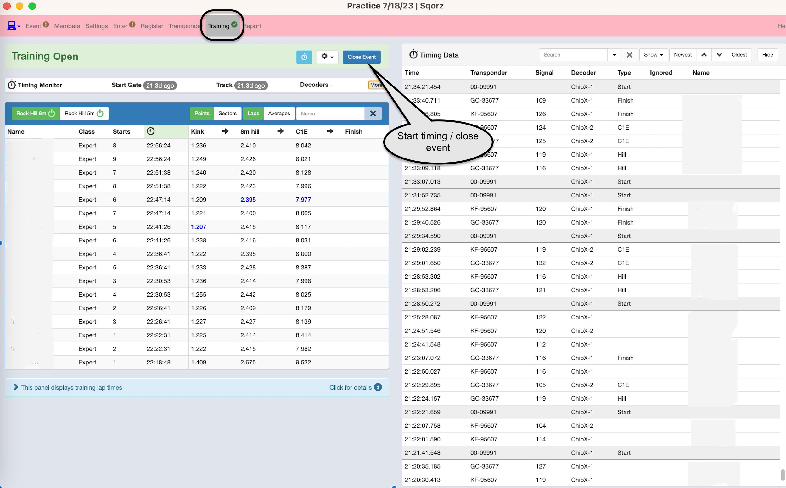

---
tags:
  - Training
  - Member Database
---
## What You Will Learn

Once you complete this tutorial you will be able to live stream an event on Facebook.

## Pre-requisites

You need to have completed the [Setting Up Your Club](Setting-Up-Your-Club.md) tutorial.

## Steps

Setting up training can be done with a few simple steps. Once the training event has been set up for the first 
time it can simply be duplicated for subsequent training events.

Once Training has been setup the rider information will automatically publish to the Sqorz Leaderboard

!!!NOTE

    Always download and install the latest member database file before running any race or training event

 Open Sqorz, go to Events and click on New
 
{: style="width:800px"}

Click on Event Template and select Training Pro

{: style="width:800px"}

Enter the event name, the date of the event and any event 
information to be displayed on the Our Sqorz app. Then click Done

{: style="width:800px"}

Click Open to download the training event to your laptop

{: style="width:800px"}

Click Show

{: style="width:800px"}

Go to Settings. Switch Timing to On, Select the decoder(s). 

If the decoders are not showing check your network settings.

{: style="width:800px"}

Enter your track name, select the decoder(s) from the drop down list, 
enable automatic registration of riders on the track.

{: style="width:800px"}

Switch on Local Web Services and enable Training checkbox to show results on a big screen

{: style="width:800px"}

Start Training / Close Event

{: style="width:800px"}

You can now use your Sqorz system for training.