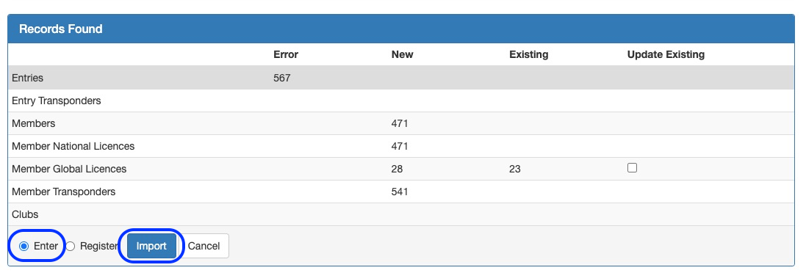
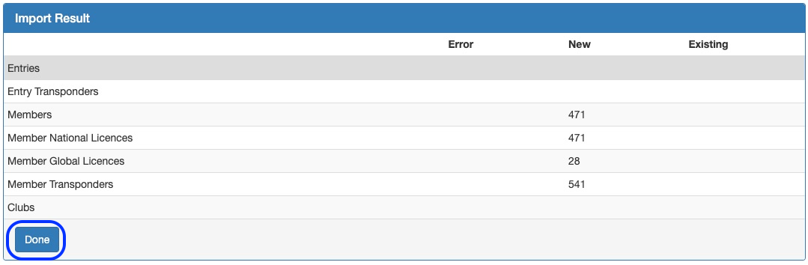
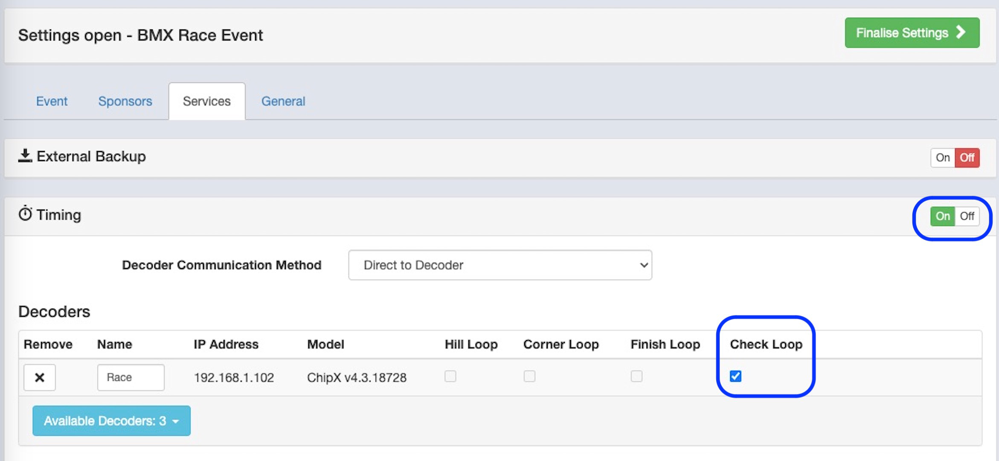
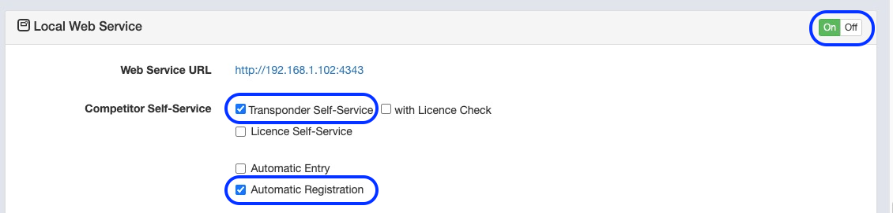
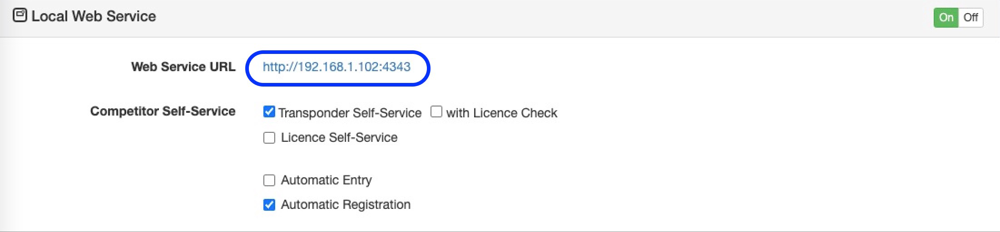
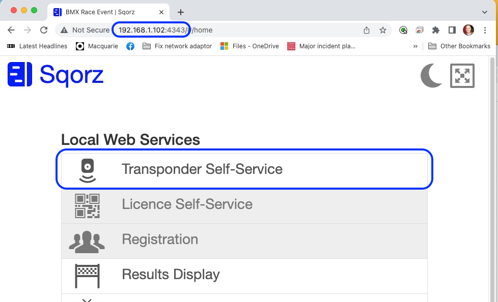
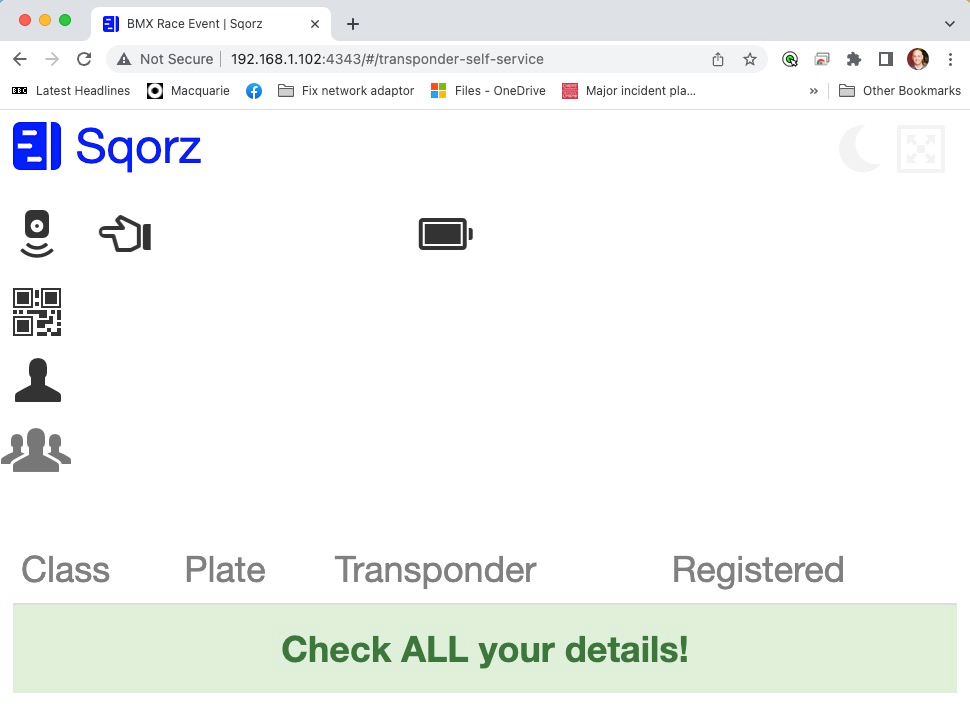

It is possible to use a checking station or a loop on the track as a method for 
registering riders who are pre-entered for an event.

- Import the rider entry list
    * Click the ‘Enter’ radio button
    * Click ‘Import’
    * Then click ‘Done’

- Open the event
- Go to Settings > Services
- Switch on Timing
- Select the decoder and the ‘Check Loop’ option for the decoder

- Select decoder and enable the Check Loop
- Switch on Local Web Service
- Check the ‘Transponder Self-Service’ and the ‘Automatic Registration’ checkboxes

- Select the transponder checking station features
- Open a the Web Services on a browser by using the IP address show as the Web Service 
     URL (Note: this URL is simply the IP address of the laptop with :4343 on the end. 
    You can find the IP address of the computer by using IPCONFIG in the CMD (Command Prompt) box.

- Make note of the Web Service URL
- Select 'Transponder Self-Service

- Open Transponder Self-Service in a browser
- And you’re ready

If you’re not sure please check with a club or organisation already using this feature