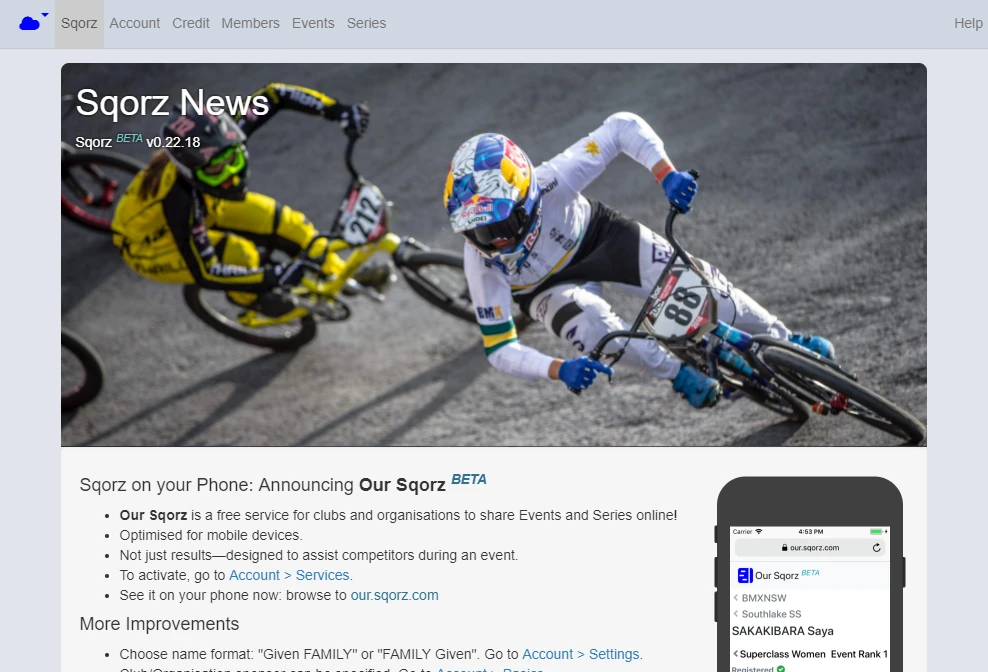
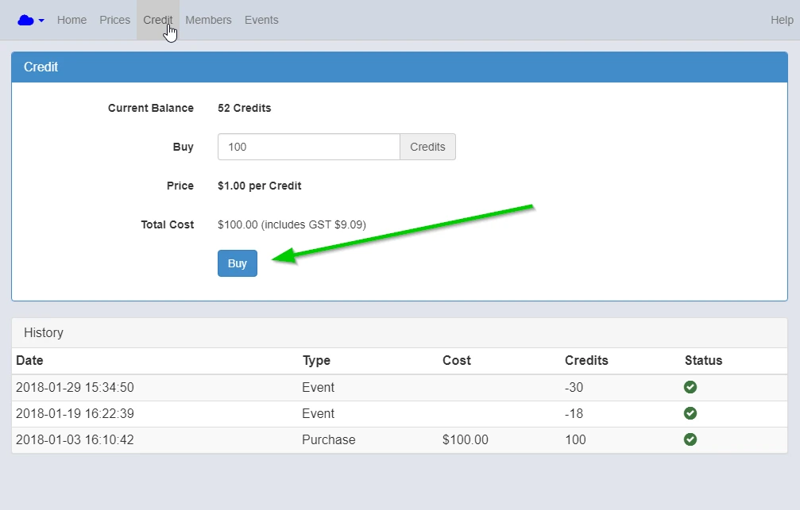

---
tags:
  - Payments
---
## What You Will Learn

Once you complete this tutorial you will be able to configure the Sqorz information screen.

## Pre-requisites

You need to have completed the [Setting Up Your Club](Setting-Up-Your-Club.md) tutorial.

## Home Screen: News
{: style="width:500px"}

Update Information here.

Click "Help" to check if your Sqorz is updated.

## Account Screen

### Basics
{: style="width:500px"}

Type in details of your organization.

You can switch accounts on Account screen.

### Services
{: style="width:500px"}

Type Short Name for your organization and click Publish if you wish to use Our Sqorz (Smartphone service).

Any info can be added in Public information.

### Settings
{: style="width:500px"}

Set Name Display here. 

Click More in any screen for complete guidance.

## Credit screen

{: style="width:500px"}

You can purchase your credits by Paypal or Credit card here.

Click "Buy" and follow the instruction.